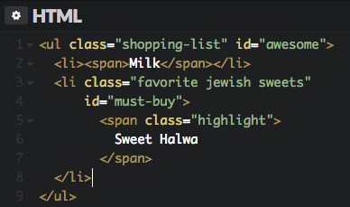
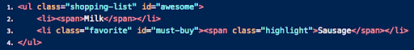

## Question A:

What color would you expect the item Sweet Halwa to show as and why?

## Question B:

What color would you expect the item "Sausage" to show as and why?

   

    

A: blue because it is the first element with the class of .highlight and the selector is more specific by using "nth-of-type" (032 vs 022)

B: blue because ul and li are both elements that only give a specificity of 2 while #must-buy is an id that gives a specificity of 100
