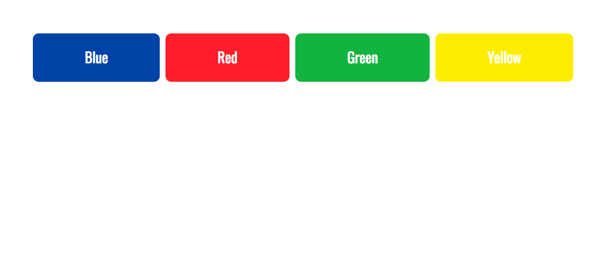

### AUSTIN COMMUNITY COLLEGE 
#### Web Software Bootcamp 

# LEARNING GOALS

Our goal this week is a brief overview of basic CSS and how to link these to external files.

We are going to discuss the differences between inline CSS, internal CSS, and external CSS, and why you would use one over the other..

We are also going to discuss the key concepts and importance of specificity and inheritance as well as a better understanding of the box model.

## Slides

1. [CSS - Introduction](https://docs.google.com/presentation/d/1FE5rck0M7hWJ87kxM-bCDjDMJ2GleycWidClVstgDGg/edit?usp=sharing)
2. [CSS - Pseudoclasses](https://docs.google.com/presentation/d/19sgRj47yQHWvscuoy0keftnSHTThZRP7IpIa_OCwk_8/edit?usp=sharing)
<!-- 4. [CSS - Practice projects]() - to be added after lectures -->

## Self Learning

1. [Front End Developer Bootcamp](https://codervox.com/p/the-front-end-developer-bootcamp/?product_id=1218866&coupon_code=100PERCENTOFF72019)

Please check out this online tutorial above, by our own Jonathan Lue.

    Focus on **Section 6** - CSS

1. #### [W3Schools](https://www.w3schools.com/css/default.asp)

#### Resources: 
1. #### [Mozilla Developer Network](https://developer.mozilla.org/en-US/docs/Web/CSS)
1. #### [Google Fonts](https://fonts.google.com/)
1. #### [Font Awesome](https://fontawesome.com)

#  PROJECTS

**Instructions:** Your task is to re-create the websites that you see from the screenshots. Each project is it’s own individual website which may have one or more pages. Detailed instructions for each project are listed below. Good luck!

## Project #1: The buttons

In this project, your goal is to create create four buttons that will be blue, red, green and yellow.
 
The blue button has color of `0D47A1`, the red button has a color of `F44336`, the green button has a color of `4CAF50`, and the yellow button has a color of `FFEB3B`.

## Project #2: Fruit Gallery

You are given 9 images and you must create a simple image gallery. Easy, right? Well, the challenge here is that the image gallery must be responsive- meaning it resizes itself when the browser window gets smaller.

### Preview

* This is a preview of how the image gallery should look on a full size browser on a laptop:
 

   
 

* This is how the image gallery should look on a medium size browser on a tablet:
 
 
   
 

* This is how the image gallery should look on a small size browser on a phone:
  
 
    
  

  
Hint: Use flexbox.

### **Links for images:**
[Bananas](./project_assets/project_2/1.jpg) 
[Cucumbers](./project_assets/project_2/2.jpg)
 
[Strawberries](./project_assets/project_2/3.jpg)
 
[Raspberries](./project_assets/project_2/4.jpg)
 
[Blueberries](./project_assets/project_2/5.jpg)
 
[Persimmons](./project_assets/project_2/6.jpg)
 
[White Raspberries](./project_assets/project_2/7.jpg)
 
[Onions](./project_assets/project_2/8.jpg)
 
[Apples](./project_assets/project_2/9.jpg)

## Project #3: Navigation Bars

For this project we are going to build out a navigation bar like the ones you would commonly see at the top of most websites.

### Preview

A screeshot of the completed page looks like this:

### Requirements

The navigation bar should:
1. Have 5 top menu items: Home, About, Locations, FAQ and Contact.
2. Hovering over ‘About’ should bring a dropdown menu that gives links to ‘Bio’ and ‘Portfolio’.
3. Hovering over Locations should bring a dropdown menu that gives links to Austin, ‘Houston’, ‘Dallas’, and ‘San Antonio’.
4. Hovering over ‘FAQ’ should bring a dropdown menu that gives links to Why do business with us and Our Partners’.
5. Hovering over ‘Contact’ should bring a dropdown menu that gives links to ‘Phone’ and ‘Email us’.
6. The top menu bars should have a dark blue color (#01579B).
7. When you hover over a top menu item, it should change to a light blue color (#9AD1E3).
8. When you hover over a submenu item, it should change to a light green color (#ACE39A).
9. The body of the webpage should have a light gray color (#ECEFF1).
10. The menu blocks should have a height of 70px and a width of 287px.
11. You should Google Fonts and have the font ‘Oswald’.

Hints:

* Your HTML will have a list within a list.
* You’ll want to remove any default styling from the lists.
* You will need to use display: block.
* You will need to use the CSS hover selector.
* You will need to use floats.

Final note: With CSS selectors, there are multiple ways of selecting things. You can achieve the same effects by doing things differently. But remember that you don’t necessarily need to create multiple classes and ID’s for everything that you want to select. For example, try selecting specific list items with “li ul li”, and links within those list items with “li ul li a”.

# Project #4: The News

Ready for more challenging project? Try to complete as many of the requirements defined below as possible.  At the end of the week, we shall 

In this project, you’ll build the front page of a website complete with a navigation bar, body and footer.

### Preview

A preview of the completed page looks like this:

  

### Requirements

The body of the page should:

* Have the font ‘Oswald’ from Google Fonts have the background color of `#eaf0f2`

The navbar should:

* Have a font size of 25px
* Have a background color of #263238
* Height of 75px
* Should change colors when you hover over a menu item (#546E7A)
* There will be five menu items: Trending, Tech, Politics, About, FAQ, Contact
* Under ‘Trending’, it should have a dropdown menu with Entertainment, Travel, and Education
* Under ‘Tech’, it should have a dropdown menu with Latest, Programming, and App Reviews
* Under ‘Politics’, it should have a dropdown menu with Headlines, The Facts, and The Gossip
* Under ‘About’, it should have a dropdown menu with Our Story and Donate
* Under ‘FAQ’, it should have a dropdown menu with Our Policy and Careers
* Under Contact, it should have a dropdown menu with Email and Phone

The logo should:

* Be 42px and have top and bottom padding of 15px, and left and right padding of 35px, and a line height of 35px.

The dropdown menu items in the navigation bar should:

* Have a height of 45px
* Have a line height of 45px
* Top and bottom padding of 15px and left and right padding of 20px
* Become a light color when you hover over a link (`CFD8DC`) 
* Have a transition time of 0.6 seconds.

The footer should:

* Have a background color of `263238`
* Have a font size of 18px
* Padding of 50px on all sides
* Margin top of 75px
* “The News” should have a color of `B0BEC5` and a font size of 28px
* The copyright should have a color of `B0BEC5` and a font size of 16px
* When you hover over the links, the color should change to `CFD8DC`

Hints:

* You will need to set the max height to 0px to make the submenu collapsed by default. You will will also need to use the position and overflow CSS properties.
* You will use the transition property to make the animation effect of the dropdown menu.
* use this image for now : [Clifftop](./project_assets/project_4/clifftop.jpg)
