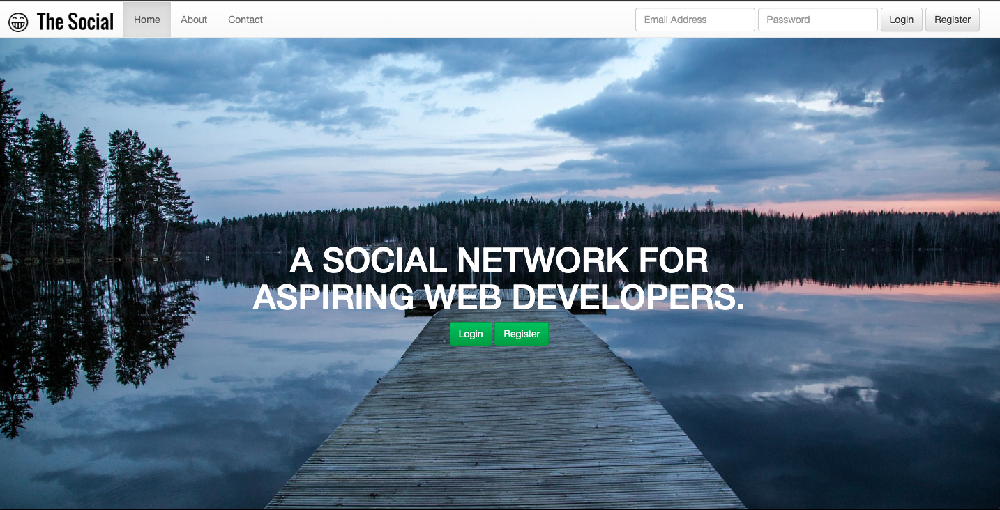

### AUSTIN COMMUNITY COLLEGE 
#### Web Software Bootcamp 

# LEARNING GOALS

So now that you have done all this hard work with CSS, we are now going to use a a framework called Bootstrap which will make your CSS experience more efficient, quicker, and allow for you to easily build resposive web sites.

## Slides

1. [CSS - Responsive Design](https://docs.google.com/presentation/d/1JtbMzEA4gYWyA944FCxffO4W4mYgYaDBtZcrfCpJCsQ/edit?usp=sharing)
2. [CSS - Flexbox](https://docs.google.com/presentation/d/1YcT0H00sLNKo6BXWneBgak4ESYwt8NXe7c7ljOU2GPw/edit?usp=sharing)
2. [CSS - Bootstrap](https://docs.google.com/presentation/d/17_99IEps6RxNhyJ5zwYk6wJt4kShUpJMo0kGNlJ8JVI/edit?usp=sharing)

## Self Learning

<!-- You should watch these courses in order to get a fuller appreciation of the topic.  In class exercises do not get sufficient time to fully understand Bootstrap. -->

1. [Front End Developer Bootcamp](https://codervox.com/p/the-front-end-developer-bootcamp/?product_id=1218866&coupon_code=100PERCENTOFF72019)

    This course has been reduced to free for you at this time.
    Please check out this online tutorial above, by our own Jonathan Lue.

    Focus on **Section 7** - Bootstrap

<!-- 2. [Coding a Coming Soon Landing Page in Bootstrap 4](https://www.udemy.com/code-a-coming-soon-landing-page-in-bootstrap-4)

3. [Understanding Bootstrap Grids and Columns](https://www.udemy.com/understanding-bootstrap-grids-and-columns) -->

#### Resources: 
1. #### [Bootstrap official website](https://getbootstrap.com/)

#  PROJECTS

**Instructions:** Your task is to re-create the websites that you see from the screenshots. Each project is it’s own individual website which may have one or more pages. Detailed instructions for each project are listed below. 

Also, all images needed are in corresponding project and img folders. Good luck!

## Project #1: Landing page

This is a simple, single page website built with bootstrap.

This website should have the background fill the entire screen, except for the navigation bar at the top. The nav bar has a logo on the left side, and a login/registration form on the right side.

* Screenshot: 

## Project #2: Social Network

**A website with three web pages for a fictional social network called ‘The Social’.**

There is a homepage, an about page, and a contact page. Each page has a navigation bar and footer.

On the about page: the columns in the middle section should remain side by side on large, medium, and small screens. The columns should stack on top of each other on an extra small screen.

On the contact page: the columns for the form field and the text need to be side by side on large and mediums screens, and then stack on top of each other when it’s viewed on a small and extra small screen.

The footer (on all pages) should have its columns side by side on all sizes, except for extra small. It should stack on top of each other on an extra small screen.

Screenshots:
* Home page 

* About page (one continuous page)

* Contact page (one continuous page)

#### Demo:

The above working pages have been demo'ed here:

[YouTube](https://youtu.be/c99-BL8ow-E)

**NOTE:** Ignore the clock in the background - You will get to do this when we study JavaScript  :)

