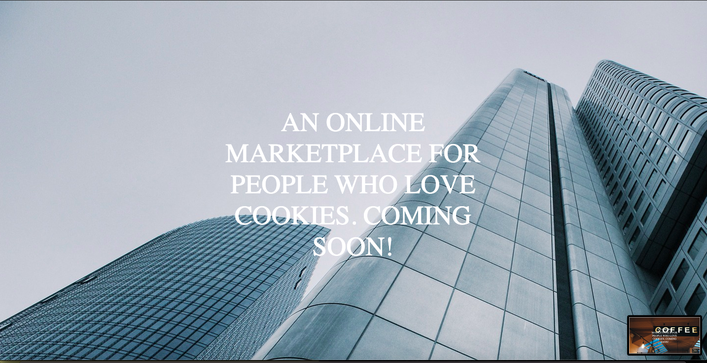
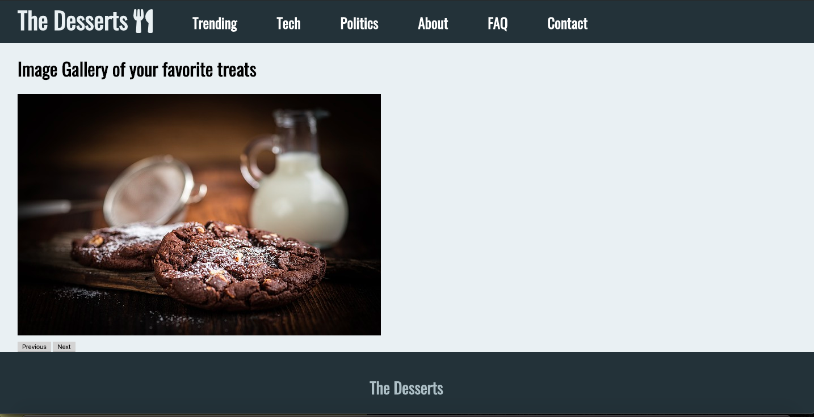

   //

### AUSTIN COMMUNITY COLLEGE 
#### Web Software Bootcamp 

# LEARNING GOALS

Ready for jumping into a real programming language? For the next few weeks, we will begin learning about one of the
central topics of the bootcamp: JavaScript.

## Slides 
<!-- TODO: uncomment slides AFTER each 'lecture' -->
1. [Lecture 1 - JavaScript - an Introduction](https://docs.google.com/presentation/d/1nNa7eba8MViSsl1h6jT0fAmcjMxqSu_Fs8RSjTedFLY/edit?usp=sharing)
2. [Lecture 2 - JavaScript - Control Flow](https://docs.google.com/presentation/d/1UXZHJi2T5joQOnJbWmTv31Bn5Fuku6cK5jDnNgN0iSs/edit?usp=sharing)
3. [Lecture 3 - JavaScript - Functions](https://docs.google.com/presentation/d/1Lem0KfwlCvjFW-Zd9byDKkI8dzXiKM06FfCAARncreQ/edit?usp=sharing)
4. [Lecture 4 - JavaScript - Arrays](https://docs.google.com/presentation/d/1eqJZoEXijv0lonxDTz8GK6wZw13_CQtpLHrx8Vj_U9I/edit?usp=sharing)
5. [Lecture 5 - JavaScript - Arrays, Objects, Strings](https://docs.google.com/presentation/d/1JGwOJadygv2yGks_WBDBTy49m6M9Xibbvay0c3Lsd3g/edit?usp=sharing)
6. [Lecture 6 - JavaScript - DOM](https://docs.google.com/presentation/d/10wz48XqfftftF_cOPv-yqp1avRzTV5HjL_OACTlIkOY/edit?usp=sharing)
7. [Lecture 7 - JavaScript - ES6 and After](https://docs.google.com/presentation/d/1xLBKQhwwsefC5bO1ffOunQdMyQx0Z6rjLyi_n0gQw8I/edit?usp=sharing)

## Self Learning Assignment

1. [Front End Developer Bootcamp](https://codervox.com/p/the-front-end-developer-bootcamp/?product_id=1218866&coupon_code=100PERCENTOFF72019)

Please check out this online tutorial above, by our own Jonathan Lue.

    Focus on **Sections 8 thru 15** - JavaScript

or, you may check out the following tutorial.  Don't need to do both ;-)

2. [JavaScript Tutorials for Beginners](https://www.youtube.com/playlist?list=PL4cUxeGkcC9i9Ae2D9Ee1RvylH38dKuET)

or, if you prefer reading a book, here's a recently launched and a very nice one ...

3. [You Don't Know JS](https://github.com/getify/You-Dont-Know-JS)

# Projects List

There are seven projects that will span the next few weeks. 

Instructions: Your task is to re-create from scratch the websites that you see from the screenshots. Each project is it’s own individual website which may have one or more pages. Detailed instructions for each project are listed below. Good luck!

NOTE: if you feel stuck on projects, then try these practices: [Practice Exercises](https://docs.google.com/presentation/d/1nwNwIn7x0nq360uf_pYNPKEHyfeoopGGZ4i-k4Byerc/edit?usp=sharing)

## Project #1: Greetings

This project will not be a “real” website per se, but rather is meant to give you practice on how to think logically using JavaScript.

Create a index.html and script.js file. When the index.html page is opened, the user should be prompted with three pop boxes that ask the following questions:

* Please enter your name.
* What is your favorite snack?
* What is your favorite drink?

After the user inputs the data, a message should display on the page “Hi there _______, it seems that you enjoy eating _______ and drinking ________!”

The blanks should be filled with text that the user wrote.
Note: make the body of page have a font size of 96px to make it easier to see.

## Project #2: The Function

This project will not be a “real” website per se, but rather is meant to give you practice on how to think logically using JavaScript.

Create a index.html and script.js file. When the index.html page is opened, the user should be prompted with three pop boxes that ask the following questions:

* Tell me your name.
* Give me a number.
* Give me another number.

You will then need to create two functions in your script.js file. 

The first function takes the name and returns a sentence that says “You are going to have a wonderful day, _____.”

The second function should return another sentence that says “By the way, the sum of your numbers is _____.” The blank should be the sum total of the two numbers that were entered by the user.

`Note`: make the body of page have a font size of 96px to make it easier to see.

You should be familiar with the differences between strings and integers, and how to convert them from one to the other.

## Project #3: The Array

This project will not be a “real” website per se, but rather is meant to give you practice on how to think logically using JavaScript.

Create a `index.html` and `script.js` file. When the index.html page is opened, the user should be prompted with three pop boxes that ask the following questions:

* Give a number.
* Give a another number.
* Give a number again.

Then create a for loop that adds all the numbers together, and writes to the page “The sum of all of your numbers is
_____.”

## Project #4: Rotating Background

For this project we are going to build a single page website that has a rotating background image with some text splashed across it..

* The background image should rotate every 3 seconds. 
* The text should be 54px.
* The text should have a width of 900px.

In order to make the images rotate, you'll need to be familiar with JavaScript and how to:
* Work with functions
* Work with arrays, as well iterating through them
* work with JavaScript DOM elements
* Use conditional statements

* SCREENSHOT: (your code will rotate through these images in order)

#### ASSETS NEEDED
- [Image 1](./project_assets/Project4/img/background1.jpg)
- [Image 2](./project_assets/Project4/img/background2.jpg)
- [Image 3](./project_assets/Project4/img/background3.jpg)

## Project #5: Image gallery

In this project, you’ll build a simple image gallery. When we press on the buttons, they will rotates through a set number of images.

The body of the page should:
* Use the same layout from CSS Project 4 (maybe in previous week), minus the previous image of the clifftop house.
* Use the `onClick` attribute in HTML
* Images should ONLY change when buttons are clicked

With Javascript, you should:
* Use functions and know how to pass arguments into them
* Work with JavaScript DOM elements
* Use conditional statements
* Use an array to hold your images
* SCREENSHOT (one page)

#### ASSETS NEEDED
[Image 1](./project_assets/Project5/img/1.jpg)

[Image 2](./project_assets/Project5/img/2.jpg)

[Image 3](./project_assets/Project5/img/3.jpg)

[Image 4](./project_assets/Project5/img/4.jpg)

[Image 5](./project_assets/Project5/img/5.jpg)

[Image 6](./project_assets/Project5/img/6.jpg)

## Project #6: The Clock

In this project, we'll build a beautiful clock that displays the time and changes background color every second.

The body of the page should:
*  Rotate through the following colors: '#4FC3F7', '#29B6F6', '#03A9F4', '#039BE5', '#0288D1', '#0277BD', '#01579B',
				  '#9575CD', '#7E57C2', '#673AB7', '#5E35B1', '#512DA8', '#4527A0', '#311B92',
				  '#7986CB', '#5C6BC0', '#3F51B5', '#3949AB', '#303F9F', '#283593', '#1A237E',
				  '#64B5F6', '#42A5F5', '#2196F3', '#1E88E5', '#1976D2', '#1565C0', '#0D47A1'

With JavaScript, you will:
*  need to use functions (and perhaps even have a function within a function)
*  need to use a new Date object to get the time
*  need to know how to get the seconds, minutes, and hour
*  need to know how to correct format the time
*  need to use conditional statements
*  need to know how to set interval to get the time every second
*  SCREENSHOT (colors will change every second)

## Project #7: Form Validator

In this project, you are going to build a simple form validator to make sure the user doesn't leave any blank fields on a form.

The form should:
*  Have an h1 that says Please enter your name and email to enter our raffle!"
*  Have two fields, an email field and password field.
*  A submit button
* SCREENSHOT

Using JavaScript, you should:
* Check to make sure that neither of the fields are blank.
* If either of the fields are blank, a pop up box appears that says "Please check the fields and make sure they are not blank."

# Bonus Project #8: Analog Clock

### In this project, you are going to extend the clock in Project #6 to make it an analog clock.  A screengrab is included here in the Project8 folder.

The clock should:
*  Have hour, minute and seconds hand.  
*  The seconds hand should turn every second.  
*  The seconds hand should have a transition effect (you may try any, the demo in class shows cubic-bezier).  

If you get here and are ready for additional practice, please ask.

* SCREENSHOT

# Bonus Projects 9: Objects

## Project 9a: The Recipe Card

Never forget another recipe!

Create an object to hold information on your favorite recipe. It should have properties for a recipe title (a string), # of servings, and ingredients list (an array of strings).

There are many ways to do this. Experiment. Have fun. Use your own CSS and personal styles.

The following was done using prompts and user input then displaying in browser.

On separate lines, display the recipe information so it looks similar to this:

### Project 9b: The Reading List

Keep track of which books you read and which books you want to read!

Create an array of JS objects, where each object describes a book and has properties for the book title, author (a string), and alreadyRead (a boolean).

Iterate through the array of books. For each book, log the book title and book author like so: 

### "The Hobbit by J.R.R. Tolkien".

Now use an if/else statement to change the output depending on whether you read it yet or not. If you read it, log a string like 'You already read "The Hobbit" by J.R.R. Tolkien', and if not, log a string like 'You still need to read "The Lord of the Rings" by J.R.R. Tolkien.'

Same as above, there are many ways to do this. Experiment. Have fun. Use your own CSS and personal styles.

The following was done using hard coded data but see if you can make based on user input for more practice.

* SCREENSHOT

# Bonus Projects 10: Mini-Exercises

Try to do as many of these mini-exercises as you can:

[Mini-Exercises](https://docs.google.com/presentation/d/1G6c41nkpWSdbY8fPEwJnxEM6tRqeX6M_2ex9iL8YStQ/edit?usp=sharing)