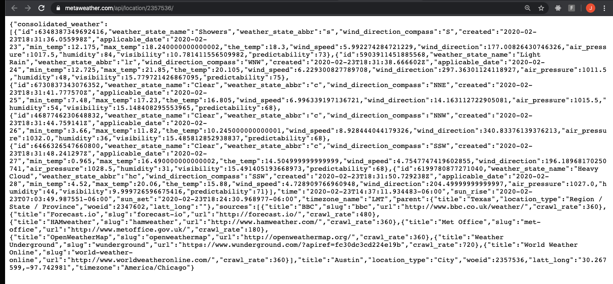
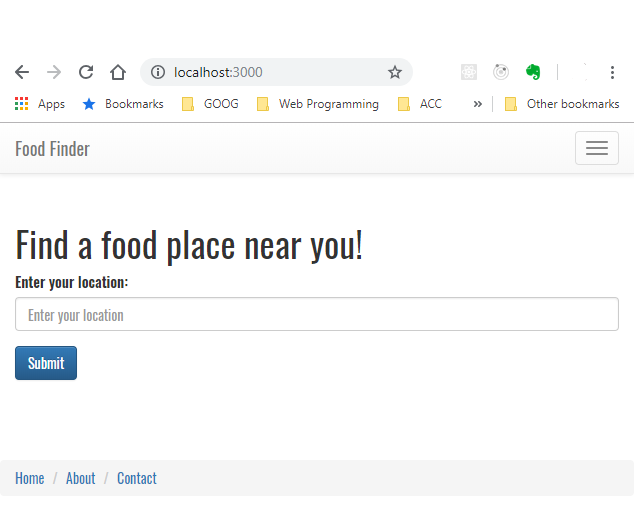
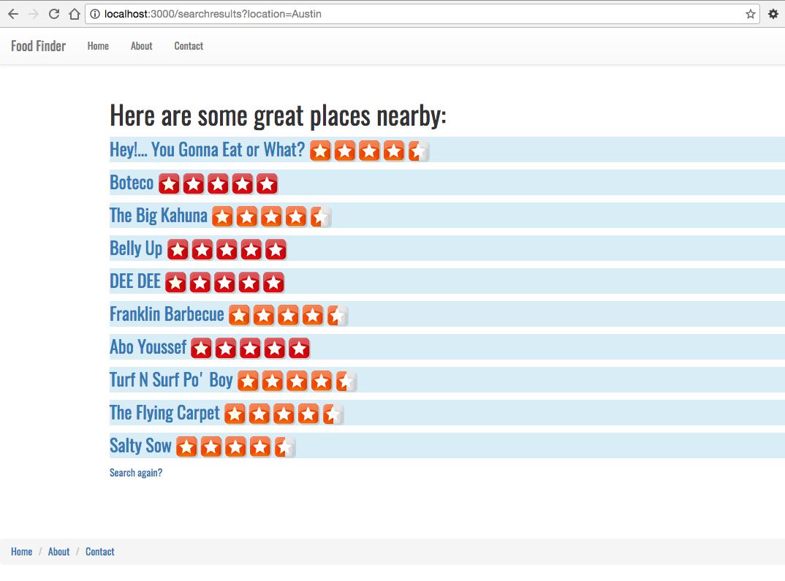
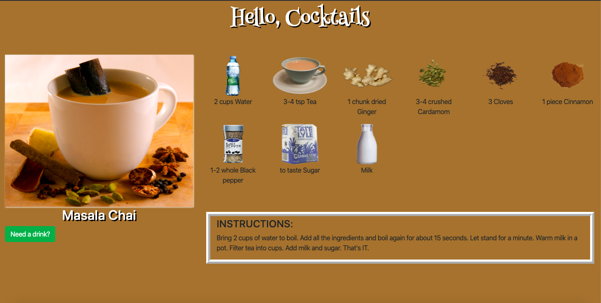

### AUSTIN COMMUNITY COLLEGE
### Web Software Bootcamp

# APIs

# Objectives

1) Introduction to APIs
1) Introduction to JSON
1) File Structure
1) Fetch and Promises
1) Build DogImage and Lyrics Apps - front end
1) Rebuild DogImage and Lyrics Apps - back end
1) Build a weather app with Node and Request
1) Review of API consumption

Welcome to APIs! 

APIs are an important subject and many companies will ask if you know how to use them, so please pay careful attention to the materials this week. You will be using everything that you’ve learned up until this point (HTML, CSS/Bootstrap, JS/Node/Express, EJS, etc.)  
  
With APIs, we can now draw data from external resources, e.g. weather data, restaurant reviews, twitter feeds, youtube videos, github repositories and users, names of your congress persons and senators, currency conversion etc.  

One of the projects will involve you building your own restaurant finding application. When a user enters their city, they would get a list of restaurants near their specified location.

Get ready for the excitement!!!

## APIs - an introduction

APIs are a fun topic because it really opens up many possibilities for what you can build. Why? 

You can build applications that use data from other applications. Up until this point, all the data we have seen has been self-generated.
But there are many companies and websites that generously offer their data for us to use as developers

The best way to explain what APIs are, is to take a look at some applications that use them:

[Flickr](https://www.flickr.com/) - get photos from a user(s)

[Reddit](https://www.reddit.com/search/?q=jokes) - get the current jokes

[Facebook](https://www.facebook.com/) - send me the status updates, likes, profile pics, and more

[Twitter](https://twitter.com/) - show me the tweets from a certain celebrity

Take a look here - <b>https://www.programmableweb.com/category/all/apis</b>

<b>TASK -> </b>Search for two categories that you may be interested in and fill out the form below. 

Find any APIs that match what you are looking for? What kind of documentation is provided? How do you use the API? Are there endpoints? Do you need to pay for it? How many calls can you make?

These are all questions (and more) you should be able to answer when deciding which API will work best for your needs.

Fill out the following:

### [Form - API Search Practice](https://docs.google.com/forms/d/e/1FAIpQLSepNM5NnWjGI1Xxeaesl6ShiQNQ_Ekp4ClmjJBXvBEF4a7iRg/viewform)

 
What is an API?

So now that we have a general idea on what APIs are, can you think of any ideas for websites/applications that you might wish to build?

What are some of your inspirations and aspirations?

How do APIs work? 

## Consuming an API

Our first exposure to APIs is generally done through 'consuming' an API. But what does this really mean? 

In short, 'consuming' refers to taking data from a third party and using it for our needs. But this comes with limitations:

  1. You must use endpoints specified in documentation. You cannot randomly assign your own endpoints and expect to get data back.
  2. You are only able to get the data back that the third party will allow. If you think Facebook is going to let you have access to phone numbers and email addresses, you are going to be disappointed.
  3. The third party will also determine the amount of data you get back. Sometimes this will be a limit per day, or even per second.
  4. The third party may also ask you to fill out forms, or join newsletters, or even to pay to use their data.

So when designing an API, you need to ask yourself, what kind of data do you need? How often do you need access to it? What are you going to do with it once you have access to it? Are you using it for personal use or do you plan on monetizing it? 

Obviously, companies like Facebook or Twitter are not going to give you direct access to their databases.

That does not mean they cannot share some of their data with us though. The data they send back looks something like this:

    {
      "coord": {
        "lon": -122.08,
        "lat": 37.39
      },
      "weather": [
        {
          "id": 800,
          "main": "Clear",
          "description": "clear sky",
          "icon": "01d"
        }
      ],
      "base": "stations",
      "main": {
        "temp": 282.55,
        "feels_like": 281.86,
        "temp_min": 280.37,
        "temp_max": 284.26,
        "pressure": 1023,
        "humidity": 100
      }
    }

This is called JSON. But what is it?

JSON is a data format. Data formats define how data is structured when we get it from an API.
There is another data format called XML which is less commonly used nowadays

JSON stands for <b><u>J</u></b>ava<b><u>S</u></b>cript <b><u>O</u></b>bject <b><u>N</u></b>otation, and it has become popular as it is more understandable and compact than XML, a predecessor.

JSON looks just like JavaScript, but it is actually a string. You need double quotes around the keys AND string values:

    {
      "firstName": "John",
      "lastName": "Smith",
      "isAlive" : true,
      "age": 25,
      "address" : {
        "streetAddress": "21 2nd Street",
        "city" : "New York",
        "state" : "NY",
        "postalCode" : "10021-3100"
      }
    }

Take a look at the JSON coming from Reddit:
https://www.reddit.com/r/news.json

And the JSON that comes from the MetaWeather API:
https://www.metaweather.com/api/location/2357536/

This probably looks something like what is in your browser:

Looks confusing?  

How can we make it more legible?
Install `JSONView` from the Chrome Web Store.  To find it, it is best to Google it.

When installed properly, it will make your JSON more legible. If you refresh your browser and try one of the above JSON links, you should see something like this now:

Please go through the following tutorials on [W3Schools](https://www.w3schools.com/js/js_json_intro.asp) to get a better idea of what JSON is and how it works. Spend as much time as you need to feel comfortable:

1. JSON Intro
2. JSON Syntax
3. JSON vs XML
4. JSON Data Types
5. JSON Parse
6. JSON Stringify
7. JSON Objects
8. JSON Arrays

## Fetch - Front End
Now that you have an idea on how the data will be sent back, you have to work on building our API. 

Keep in mind, there are two ways to build an API - on the front end and on the back end. We are going to start with a front end API.

In order for this to work, we are going to use Fetch. There are many ways to do this, some more complicated, but Fetch is a good starting point on how to make an HTTP request from the front end. 

    “The Fetch API provides a JavaScript interface for accessing and manipulating parts of the HTTP pipeline, such as requests and responses. It also provides a global fetch() method that provides an easy, logical way to fetch resources asynchronously across the network.”

Please check out [MDN](https://developer.mozilla.org/en-US/docs/Web/API/Fetch_API/Using_Fetch) Web docs for more details on Fetch:

Here is the basic format for Fetch:

    fetch(url)
      .then(function(response) {
          // do something with the response
      })
      .then(function(data) {
          // do something with the data
      })
      .catch(function(error){
          // what if there is an error?
      });

This tells the code to ‘fetch’, or ‘get’ the url we are looking for.

    fetch(url)

As long as there are no errors, then send a response back that we can do something with. Generally we need to parse this data as it oftens comes back in JSON format.

      .then(function(response) {
        // do something with the response 
        // as long as there are no errors
      })

This takes the parsed response and allows us to manipulate the data however we want. Do something with the data so we can get it back to the browser

      .then(function(data) {
        // do something with the data
      })

If there is a network error, we need to handle it somehow.

      .catch(function(error){
        // what if there is an error?
      });

Great link about how fetch deals with errors: https://www.tjvantoll.com/2015/09/13/fetch-and-errors/

This formatting may look a little strange, but they are called Promises.

      .then(function(response) {
        // do something with the response
      })
      .then(function(data) {
        // do something with the data
      })

“A promise is commonly defined as a proxy for a value that will eventually become available. Promises are one way to deal with asynchronous code, without writing too many callbacks in your code.” - https://flaviocopes.com/javascript-promises/

## Fetch - Back End

So what if you want to do a server-side HTTP request using Node? 

Bad news, you cannot do this with Fetch. 

Good news, there is a node module called <b>`node-fetch`</b> which does the same thing. You only have to install it and you can use it just like regular fetch. The benefit of this is that you are only having to learn one system to make HTTP requests and you now can do this on the front end and back end. 

Check out the link her for more information:
<b>[node-fetch](https://www.npmjs.com/package/node-fetch)</b>

Please take the following quiz:
### [QUIZ 11 - JSON and Fetch](https://docs.google.com/forms/d/e/1FAIpQLSfyqMnyuBY2vImMJAX426SqQde1ptYiIMiX2KWq67b_PEGWJg/viewform)

Please read through the following article as it will be very helpful in the upcoming projects and in your overall understanding of the asynchronous nature of JS.

### [Introduction to Asynchronous JavaScript](https://app.pluralsight.com/guides/introduction-to-asynchronous-javascript)

## PROJECTS

## Project 1: Bitcoin Price Checker App

In this project, you are going to build an app that retrieves the current price of Bitcoin and displays it in the browser, when the user clicks a button.

In order to complete this exercise, you will require the following API documentation:

https://www.coindesk.com/api

Check it out and get familiar with how to use it. This will be done with a server and EJS. You will need to use `node-fetch`.

Your finished app page, should look something like this

<strong>Hints:</strong>

These might help you build the above app:

1. Use `index.ejs`,  `header.ejs` and `footer.ejs`

1. Make sure to include `Powered by CoinDesk` per CoinDesk documentation

1. HTML Forms: learn how to use the a form and a input of type submit.

1. How exactly does the GET method work?

1. What is the difference between `req.params` and `req.query`?  What would you use in this app?

1. HTML entities

1. Research the differences between `<% %>` , `<%= %>` , `<%- %>`

1. You may need and use [number methods](https://www.w3schools.com/js/js_number_methods.asp)

## Project 2: Movies Playing Now

This project is designed to test your knowledge of the front end as well as the back end. You will be building an application that allows users to find current movies playing in the theaters. Use EJS.

The home page should look somthing like this: 

Go to pixabay.com and search for an appropriate image and use `h1` tags for the text on main page.

When they click on the button, they are taken to a page that looks like this (note that the movies listed may be different from you have): 

When the user clicks on the button on the home page, they are taken to another page which lists four things: the movie title, overview, rating, and poster image.

You will be using the The Movie Database API. Its documentation can be found here: [API Docs](https://developers.themoviedb.org/3). 

Please note that a user key is required to read the data. It is free to sign up. Read the instructions on how to use the API. You <b><u>WILL</u></b> be using this API multiple times so please sign up for the API key.

Remember, you want to list the movies `now playing` in theaters.

Make sure you check out TMDb documentation on how to grab `images` and their paths.

Lastly, add the following to your package.json:

    "nodemonConfig": {
      "delay": "2500",
      "env": {
        "NODE_ENV": "development",
        "PORT": "3001"
      }
    }

You will know that you have done this correctly, because when you start your server, it should automatically be listening on port 3001. 

Start your server with `nodemon` 
If you have not done so, you may need to check out docs here: npmjs.com/package/nodemon

How do you display in your browser?

## Project 3 

Your task is to redesign the Bitcoin app from Project 1 and make it all run on the front end - no server.

## Project 4: Food Finder

1. We will be using the public API from Yelp. In order to use it, you’ll need to create an account on Yelp. From the developers page, you’ll need to retrieve your client ID, and API key: https://www.yelp.com/developers/v3/manage_app

1. You will also be using the Yelp nodejs module. This module will make it easier for us to make requests. https://www.npmjs.com/package/yelp-fusion

1. You will also need EJS and Express.

1. You should also look at the Yelp documentation, especially on the search parameters when making requests: https://www.yelp.com/developers/documentation/v3/get_started

1. Create two main pages: 
  - home.ejs page, and 
  - searchresults.ejs page.

1. The home.ejs page has a form that allows a user to enter a city. When they hit the submit button, it should take them to the searchresults.ejs page where the list of restaurants is displayed.

1. The searchresults.ejs page should display up to 10 search results. They should be linked to their respective Yelp page, and an image of their rating should be next to each link.

1. Use bootstrap for styling.

1. Use partials to hold your boilerplate header and footer HTML code.

1. This project will exercise your ability to drill down on an object. If you need help, ask!!

Screenshots of the project:

## Project 5 - BONUS

Your goal is to build a site, all on the front end, that allows the user to click a button and a random drink is displayed in the browser similar to that below:

Click the button and you get a new drink:

and when you are on a small screen, everything will stack on top of each other:

 

1. Use the following for documentation: https://www.thecocktaildb.com/api.php

1. Use&nbsp;` Henny Penny` &nbsp;from Google Fonts in an `<h1>` tag for the `"Hello, Cocktails"`

1. Use &nbsp;`Bootstrap` for responsiveness

## Project 6 - BONUS

Your goal is to redo Project 5 so that it runs on the backend. Use `EJS` for templating and accepting data from the backend.

Use the following drink object for initial screen data (if you need):

    const initDrink = {
        strInstructions: `Mix lemonade and water according to instructions on back of can. If the instructions say 
        to add 4 1/3 cans of water do so. Mix into pitcher. Add 1 1/2 cup of Vodka (Absolut). 
        Mix well. Pour into glass of crushed ice. Excellent!`,
        strDrink: 'Shark Attack',
        strDrinkThumb: `https://www.thecocktaildb.com/images/media/drink/uv96zr1504793256.jpg`,
        strIngredient1: 'Vodka',
        strIngredient2: 'Vodka',
        strIngredient3: 'Vodka',
        strIngredient4: 'Vodka',
        strMeasure1: '1st can',
        strMeasure2: '2nd can',
        strMeasure3: '3rd can',
        strMeasure4: '4th can',
        imageSrc: "https://www.thecocktaildb.com/images/ingredients/gin-Small.png"
    }

## Labs - In Class

1) Lab 1 - Dog Image App - Front End
1) Lab 2 - Lyrics App - Front End
1) Lab 3 - Dog Image App - Back End
1) Lab 4 - Lyrics - Back End
1) Lab 5 - Weather App - intro
1) Lab 6 - Weather App - 5_Day - if time

## Cheat Sheet
	
FILE STRUCTURES (order may vary):

	Basic Backend (server):
		PARENT FOLDER
              app.js
              package.json
              package-lock.json
              node-modules (folder)

	Basic Backend (server and EJS):
		PARENT FOLDER
              app.js
              package.json
              package-lock.json
              node-modules (folder)
              views (folder)
                  home.ejs
                  partials (folder)
                      header.ejs
                      navbar.ejs
                      footer.ejs

	Basic Backend (server, EJS, and CSS):
		PARENT FOLDER
              app.js
              public (folder)
                  style.css
              package.json
              package-lock.json
              node-modules (folder)
              views (folder)
                  home.ejs
                  partials (folder)
                      header.ejs
                      navbar.ejs
                      footer.ejs
                      whatever.ejs