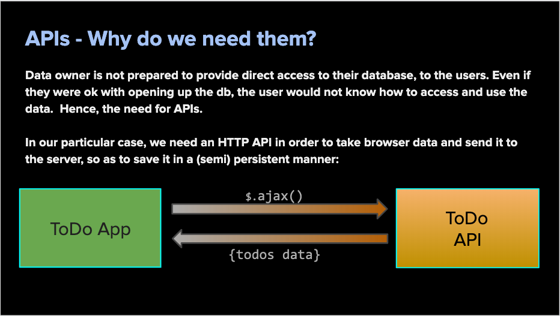
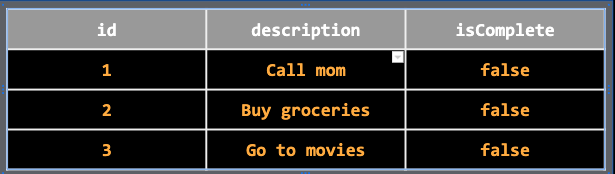
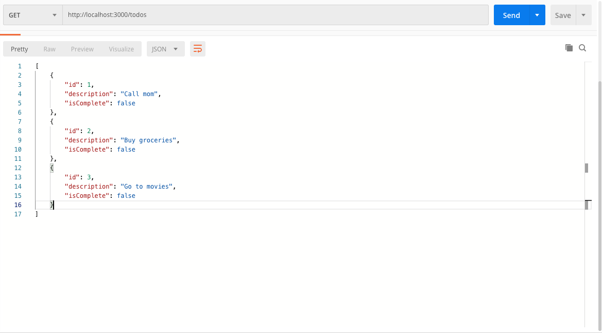
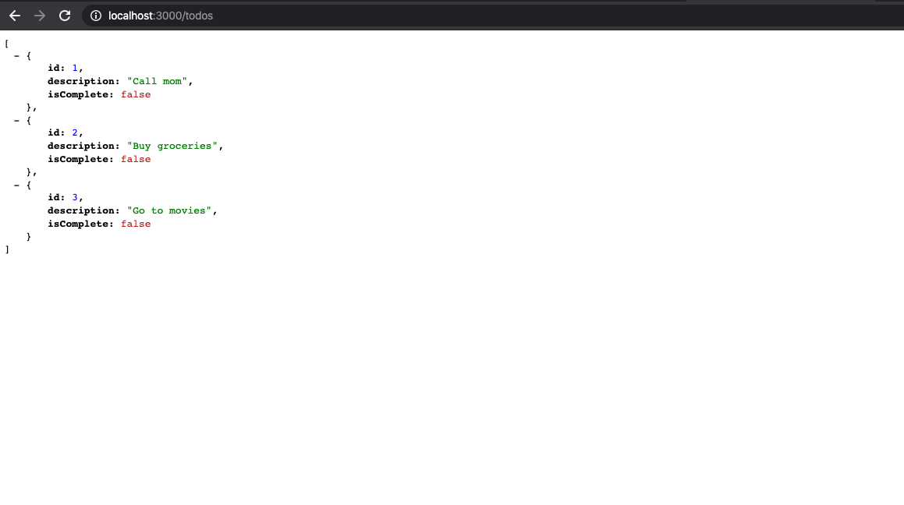
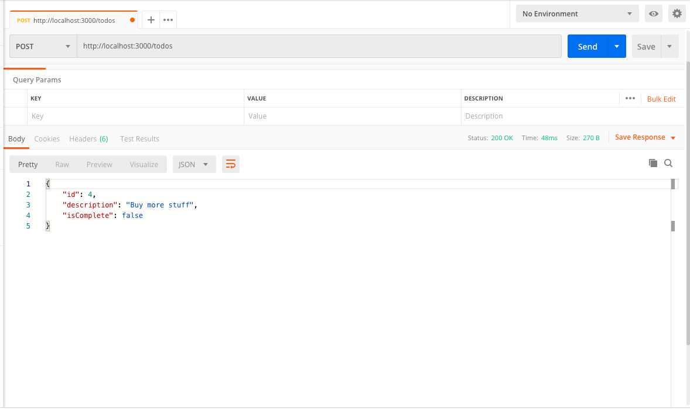
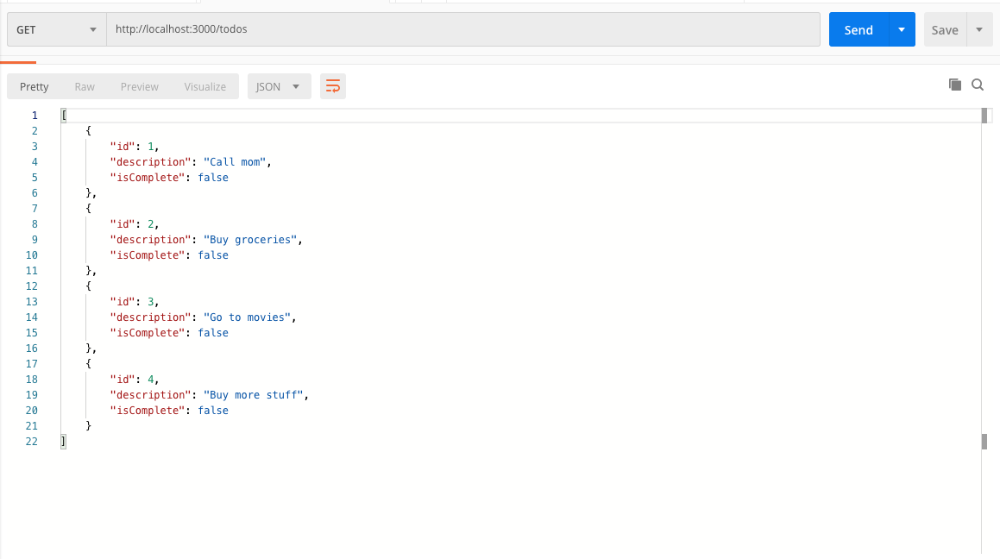
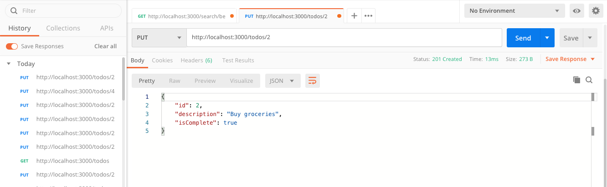
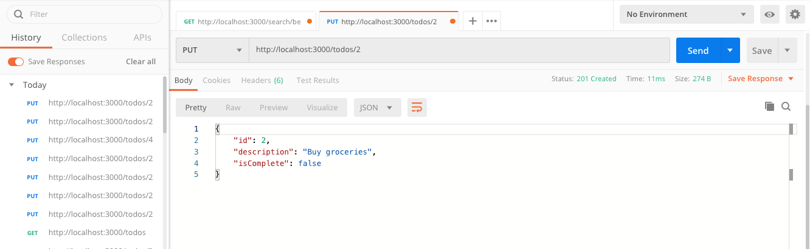

### AUSTIN COMMUNITY COLLEGE
### Web Software Bootcamp

# APIs - Serving the ToDo App

# Objectives

1) GROK IT
1) Understanding benefits and issues between consuming and serving an API
1) SPAs - Single Page Applications
1) What is AJAX?
1) What is CRUD?
1) HTTP status codes
1) How to think like a backend developer.
1) Build a backend server for our ToDo App
1) Connect backend server to front end ToDo App - AJAX

## Grokking

In order to truly understand what is happening with APIs (and further on...), you are going to see the term: 

    *** GROK IT -->

This means you are expected to do some outside research and truly understand what the concept is. And yes, plan on that topic being on a quiz.

Your first grokking topic would be:

### <b>GROK IT --></b> What is 'grokking?' 

## APIs

We are going to continue our discussion of APIs. Remember, APIs are interfaces that let computers/applications talk to each other.

So far we have worked with consuming APIs (MetaWeather, Bitcoin and Lyrics). 
How did these work? What were some of the challenges?

Now we are going to work with building and serving our own API. How is this different than consuming data from an API?

### Consuming
- Third party APIs
- We have no control over what data and how much is received
- Limited ways to receive data
- Understanding the documented methods is critical. Look for samples.

### Serving
- You own the API
- You control what data and how much will be sent back
- Unlimited ways to send data
- Security and robustness is important

But before we can dive into AJAX, and serving up our own API, we need to talk about SPAs.

## SPA

What is a SPA?

Take a look at costco.com and click on the various links. What do you notice about the address bar?

Now look at tuble22.com. What do you notice about the address bar as you clicked on most of the links?

With the Costco site, you should notice that most of the links cause a refresh of the page or redriect to a completely different page.

At T22, most of the links caused the page to move up and down - there was no refreshing of the page or new html added. T22 is an example of a SPA.

SPA - stands for `S`ingle `P`age `A`pplication.
Another good example of a SPA is stories.readymag.com/mollino/

Watch the address bar? Notice how the page never refreshes yet the routes keep changing?

Checkout https://www.awwwards.com/websites/single-page/ for more inspiration on what can be done with SPAs.

## AJAX

From developer.mozilla.org/en-US/docs/Web/Guide/AJAX :

"`A`synchronous `J`ava`S`cript and `X`ML, while not a technology in itself, is a term coined in 2005 by Jesse James Garrett, that describes a "new" approach to using a number of existing technologies together, including HTML or XHTML, CSS, JavaScript, DOM, XML, XSLT, and most importantly the XMLHttpRequest object."

"When these technologies are combined in the Ajax model, web applications are able to make quick, incremental updates to the user interface without reloading the entire browser page. This makes the application faster and more responsive to user actions."

"Although X in Ajax stands for XML, JSON is used more than XML nowadays because of its many advantages such as being lighter and a part of JavaScript. Both JSON and XML are used for packaging information in the Ajax model."

Although there are numerous methods and documentation out there on AJAX and its uses, we are going to focus on high-level basics. We encourage you to do more research on your own to explore these differences at a later time - <a href='#AJAX'>AJAX Resources</a>

In the meantime, please note that AJAX is actually a concept, not a true technology; hence, the myriad ways to use it.

So far, we have controlled the flow of data primarily by user input and then making HTTP requests:

1) You have used Postman for testing data without a browser.
1) You have used Fetch, both on the front end and the back end.
1) You have seen how to use the Request module

And what do these all have in common: page refreshes of some sort. We have used EJS and various `.html` files in order for the user to see data when it comes back through the API. 

For us, AJAX is going to allow us to make these requests, verify all data is accurate both on front end and back end, as well as render data back to the front end without refreshing the page. How are we going to do that?

We are going to use our <b>ToDo</b> app we built way back in our foundation class (aka the Trial Class). Do not worry. If you were not able to make that class, starter code will be provided so we are all on the same page.

Before you begin work on this restructured, app, there a few new node modules you will want to familiarize yourself with:

### MORGAN (dev dependency - optional)

Great tool for logging requests and responses in an Express application: 
https://www.npmjs.com/package/morgan

Log examples from ToDo API's console:

    POST /todos 200 49.956 ms - 224
    PUT /todos/3 200 7.642 ms - 223
    GET /todos 200 0.460 ms - 223
    GET /todos 304 1.594 ms - -

What this tells us is:

    Line 1) POST request to route /todos succeeded with a status code of 200 and took 49.956 milliseconds to deliver a response length of 224 bytes

    Line 2) PUT request to route /todos/3 succeeded with a status code of 200 and took 7.642 milliseconds to deliver a response length of 223 bytes

    Line 3) GET request to route /todos succeeded with a status code of 200 and took 0.460 milliseconds to deliver a response length of 223 bytes

### <b>GROK IT --></b> What is going on with line 4? 

But what does all that mean?

## CRUD

    Create	*** POST method	 	
    Read	*** GET method	
    Update	*** PUT method		
    Delete	*** DELETE method 

Using Facebbok as an example, `CRUD` is a way to acknowledge you have a fully functional API that will allow you to - 

`C`reate data - Think about every time you post something on Facebook - you are creating new data that needs to be handled (processed). This is accomplished by using the <b>POST</b> method.

`R`ead data - when a user first goes to thei personal Facebook page, there is often already posts from friends and family members. This is accomplished by 'reading' the data from a 'database' and returning the data to the browser where it is displayed in a manner agreed upon by the front end (AJAX, authorization, security, etc...). This is done with the <b>GET</b> method.

`U`pdate data - when a user wants to change something. When your friends post a picture on Facebook and you go in to tag yourself or others, you are updating the data. This can be done a few different ways but our focus will be on the <b>PUT</b> method. Another way to update data is using the <b>PATCH</b> method but we will not be using it at this time.

`D`elete data - if you do not like your friend's post, or see something that should not be on your Facebook page, you have the option of deleting them, or even unfriending as necessary. By deleting data, you will use the <b>DELETE</b> method.

### <b>GROK IT --></b> What other methods are there besides the ones listed above?

## HTTP Status codes

In order to better understand what HTTP status codes are and what they mean, please reference this site: https://www.restapitutorial.com/httpstatuscodes.html

If you would like something a little more fun, but without the details: https://http.cat/

What is great about `http.cat` is that it is an API all by itself and can be consumed with the appropriate endpoint, allowing use of the cat images on your own personal pages.

## BODY-PARSER (dependency - required)

The body parser middleware is used to extract the body from the incoming requests. In short, it extracts the data out of the request headers like the form data, etc,. It provides modules to parse different content types of data including:

- URLEncoded data strings (<a href='#bp'>see reference below</a>) or 
- JSON objects

As you should already know what JSON objects are, it is important to undersand a bit about `urlencoded` data.

[Understanding HTML Form Encoding](https://dev.to/sidthesloth92/understanding-html-form-encoding-url-encoded-and-multipart-forms-3lpa) - take a look at this blog and pay attention to the info about forms.

In a nutshell, when we were using Fetch to make HTTP requests, by default, we were using the `GET` method to send data through the URL. This data became public to anyone watching the address bar in the browser.

But what if we are asking for private information like passwords or social security number? Should this data be displayed in the browser for all to see?

Or what if you wanted to send a large file with thousande of bytes of data? Or you wanted to send an image? These can not be sent through the url so another method and process needs to be used.

We will discuss in more detail during lab times, but for now, understand that when using forms and the `POST` method, data will be kept private and sent through the `body` instead of the url. This also means we will need to retrieve values differently then when we did with the url (i.e, `req.params.variable`).

Before we can even think about retrieving these values, we need to 'parse' the 'body'; hence the need for under the hood code that does that for us: `body-parser`.

### [Quiz #12 - AJAX, CRUD, HTTP requests](https://docs.google.com/forms/d/e/1FAIpQLSefbxOasvArm7EYKOIQEs9VEkyoHGJbZj3LjulZ7wiPIrVZjw/viewform)

## Backend Developer Thinking

One of the challenges for back end devlopers is the idea of writing code without knowing what is happening on the front end. That is ok. In fact, this is a normal way of life for many developers. 

In order to demonstrate this, to give you an idea of how this works, you are going to take all the information you have learned so far and apply it to building a fully-functional CRUD project: ToDo App.

Also, it is important to remember, this is a learning opportunity and requires an open mind to go on this journey. In fact, the following two projects could be done in reverse order. However, as we are focusing on the back end aspects of developing, you are going to start with building a server with fully-fuctioning CRUD methods and then you are going to connect it to the front end app with AJAX.

You will build part of this app on your own, we will build part of the app as a class, and then you will fine tune it on your own.

How does this tie into back-end thinking?

Imagine your job is to take data from the front end and be able to manipulate as necessary. All you are given is the following information:

    1) Must be CRUD functional
    2) There are only two routes that will be used: /todos and /todos/:id
    3) Data must be sent back to the front end, ready to use

How do you work with such little information?

### <b>GROK IT --></b> Be ready to discuss your thoughts and challenges to this in class.

## PROJECTS

## Project #1: ToDo App Server

The goal is for you to have a server ready to go by assigned class date which can handle the the GET and POST requests. If possible, please have the DELETE and PUT requests completed also. Otherwise, we will 'rebuild' this server in class.

 Our ToDo App runs in the browser. This means a couple things - our data (todo items) only exist as long as our browser is open. Refresh the browser and all our data is gone. With a server, our data will be semi-persistent, meaning our data will exist as long as our server is running and no matter how many times we close or refresh our browser, the data will be saved until the server is re-started.
 
 In order for it to connect to the client (back end) we need to have an API.  We will build (serve) our API using node/express and the following steps:

### Task #1: Build a Server

    - Create a directory called TODOS
    - Inside TODOS, create a directory called server
    - Inside server, create a file called server.js
    - In the server directory, run npm init
    - Install express, morgan and body-parser
    - Build a basic server
    - Write all code necessary to allow use of Morgan and Body-parser (reasearch documentation if needed)
    - Create and set a port variable to process.env.PORT or 3000
    - Add root route handler into the server.js file
    - Start listener
    - Start this server and test it, using browser, curl or Postman

### Task #2: Fake data

Next, you need to create some hard-coded data to use for testing and to start our todo API.

In your `server.js` file, build an array called <b>toDoArray</b> with three JavaScript objects, which encode the following data:

### Task #3: Build API - cRud - Read

Before you proceed: 

### <b>GROK IT --></b> What are the differences between res.end(), res.send(), res.render(), res.json()

In order to test and ensure we have access to the `toDoArray`, we need to build our first route to “read” our data (array) and send a response:

    - Build a route using GET method in your server.js file to send data back to the front end once user goes to the '/todos’ route.
    - Use Postman to test if the route works.

If you have done this correctly, you will get a your `toDoArray` values displayed on Postman and may have noticed you have no HTML or front end, etc… 

This is why Postman is a great tool for testing data sent and received without a browser.

Now test this in your browser:

In your terminal, you should see something like this:

    Listen on port 3000
    GET /todos 200 3.183 ms - 169

This tells you that you ran a GET request using the /todos route. It succeeded with a status code of 200, response length of 169 bytes and took 3.183 ms.

### Task #4: Build API - Crud - Create

Using our `toDoArray`, we are now going to build a route that adds (POSTs) a new object to the array. This is how we are going to create a new todo:

    - Build a route using the POST method in your server.js file to send data back once user goes to the '/todos' route.
    - Create a new object with an `id` of 4, `description` is ‘Buy more stuff’ and `isComplete` is false.
    - Add this new object to current array.  What Array method would you use to do that? There are many ways but keep it simple
    - Test with Postman
    
If this works as expected, you should see something like this:

Run your GET request again in Postman. If you have done everything correctly, you should now see something like this:

If you take a look at what is happening with with your logger at this point, you may see something like this:

    GET /todos 200 0.377 ms - 169  (line 1)
    POST /todos 200 0.891 ms - 58  (line 2)
    GET /todos 200 0.215 ms - 228   (line 3)

### <b>GROK IT --></b> What is the difference between line 1 and 3? How does line 3 relate to line 2?

### [Quiz #13 - Backend Thinking and Todo Server](https://docs.google.com/forms/d/e/1FAIpQLSeEs9BUr05s1tjhfNpeL9NhjBjWhdRVafQmeZ1g16KgM3qxWA/viewform)

### Task #5: Build API - cruD - Delete

You now have an app that fulfills two of the four CRUD functions - Create and Read. But now there needs to be a DELETE option.

How is the DELETE going to work?

We shall allow the deleting of only one todo at a time.  Hence the client needs to send us an ID for the "requested" todo that they would like to delete.  Based on our available routes and methods, you are going to use:

    DELETE route -> /todos/:id

Here the `:todoid` is a variable that is attached to the URL of the HTTP request.  We can read this from the request object and use to delete only that item. Keepinthe following in mind, build a delete route handler:

    - Build a route using the DELETE method in your server.js file once user goes to the '/todos/:id' route.
    - Ensure that you get a number back and not a string
    - Use the Array.findIndex() method to verify that your id exists
    - Use the Array.splice() to remove the item from the toDoArray
    
Test with Postman and your browser. If you did this correctly (using the methods above), you WILL see your items delete. 

However, what happens if you try to delete an item already deleted? 

### <b>GROK IT --></b> What is happening? Why? HINT: how does .splice() work?

### Task #6: Build API - crUd - Update

Using your `toDoArray`, you are now going to build a route that UPDATEs a specific object from the array:

    - Build a route using the PUT method in your server.js file to send data back once user goes to the '/todos/:id' route.

    HINT: app.put(route, callback);

    - Use the .find() method to find the affected todo item

QUESTION: what are we actually updating? why?
How do we pick which item to update?

    - Toggle the 'isComplete' status every time that 'id' is chosen
    - Try to code your ToDo API using the methods shown earlier with the other CRUD functions.
    - Test with Postman. You should see something like this:

After you send route again:

What issues do you start to see arise?

## Project #2

Take a look at the following code located inside the 

    99_Demos/TODOS/todosTrialClass 

folder.

When ready, please take the following quiz:

### [Quiz #14 - Trial Class ToDo App](https://docs.google.com/forms/d/e/1FAIpQLSeye8koaExRAE0iVAnP5Bn-TBNtrPQxwzvGmd7UY4ocw2hi6Q/viewform)

## Project #3

We will do most of this in class, but we need to connect our Trial Class Todo app (frontend) with the backend (server.js).

In order to make this work there are a few topics that need to be addressed:

### <b>GROK IT --></b> 
1) What are html `data` attributes and how to use and reference values?
1) What do we mean by `bubbling` and `capturing` in regards to HTML Dom events?
1) What is `event.stopPropagation()` and how is it used to control bubbling and capturing?

We are also going to use jQuery AJAX and our 'framework' will be:

    $.ajax({
        data: { // POST only (for now) - simulates the body for server-side
            key: value,
            key: value 
        }, 
        url: "", // what is the url (path) we need to trigger server API?
        method: "" // What method? GET, POST, PUT, etc...
    })
    .done(function(dataObj){
        // What do we do with the data object once we get 
        // an ok and any data from server-side?
    })
    .fail(function(errObj){
        // What do we do with the error object if there 
        // is an error server-side?
    })

Another topic that will undoubtedly come up is CORS. Please click on the link below to understand a little about what is happening:

[Cross-Origin Resource Sharing (CORS)](https://developer.mozilla.org/en-US/docs/Web/HTTP/CORS)

and how to resolve:

[NPM CORS](https://www.npmjs.com/package/cors)

Now you are ready to start connecting the back end (server.js) to the front end Trial Class ToDo app using AJAX.

## Labs - In Class

    - Build ToDo App Server
        -  complete CRUD functionality
    - Go over Trial Class ToDo App
    - Connect Server to Trial Class ToDo App
        - Use jQuery AJAX concepts
        - complete CRUD functionality
        - CORS
        - propagation
        - concepts of events and 'this'

## RESOURCES

<h3 id='AJAX'>AJAX</h1>

[MDN - Getting started with AJAX](https://developer.mozilla.org/en-US/docs/Web/Guide/AJAX/Getting_Started)

<h3 id='bp'>BODY-PARSER</h1>

[NPM body-parser](https://www.npmjs.com/package/body-parser)

[Content Types w/ Postman](https://medium.com/@rajajawahar77/content-type-x-www-form-urlencoded-form-data-and-json-e17c15926c69)

<h3 id='port'>PORT</h1>

[What is process.env.PORT in Node.js?](https://stackoverflow.com/questions/18864677/what-is-process-env-port-in-node-js)

    let port = process.env.PORT || 3000;

Locally, this does not do anything, but hosting sites will set PORT to that which they are running on: https://www.twilio.com/blog/2017/08/working-with-environment-variables-in-node-js.html

<!-- ## Terminology

<b>CRUD</b> - description of what this means

<b>AJAX</b> - description of what this means

<b>consuming APIs</b> - description of what this means

<b>serving APIs</b> - description of what this means

<b>grokking</b> - description of what this means

<b>body-parser</b> - description of what this means

<b>morgan</b> - description of what this means

<b>req.params</b> - description of what this means

<b>req.query</b> - description of what this means

<b>req.body</b> - description of what this means

## Cheat Sheet

Anything special that needs to go here to help students -->

