

### AUSTIN COMMUNITY COLLEGE 
#### Web Software Bootcamp 

# Mongo and Mongoose

# Objectives

1) Install Mongo
1) Install Robo3T
1) SQL vs NoSQL
1) Mongo commands
1) Robo3T uses - inclass
1) Mongoose
1) Convert ToDo App -inclass

# LEARNING GOALS

## Databases

What are databases?

They are amazing piece of technology that are used to store almost all the data for an application. They are ...

    - reliable
    - secure
    - able to provide single version of truth
    - able to offer fast response
    - used by many end users
    - often used for heavy number crunching
    - usually in the back-end

For example, what would our ToDo data look like if we were to store it in a table? It would look something like this:

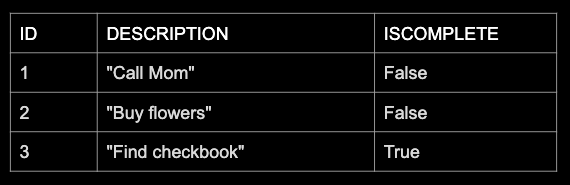

This is a well known table structure. It is called a relational table.  It provides structure to our data, hence called a structured database.

If we wanted to add another piece of information to this table, we would not be able to ...

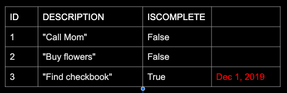

... unless a database administrator agreed to add another column to the table.

When we talk about using structured tables we also imply that we need some kind of structured language; this is often referred to as `SQL (Structured Query Language)`. 

Examples include (but not limited to):

    - Oracle SQL
    - MySQL
    - PL/SQL
    - PostgreSQL

We will go into more details about SQL in the next database module. In the mean time, our focuse is going to be on a NoSQL called Mongo.

## MongoDB

MongoDB is one of the NoSQL databases which allows for flexible schemas (a schema represents the structure of how data is stored).  In MongoDB, it is a easier to change the schema during use, than with relational databases like Oracle or MySQL.  

Here, data is stored as JSON like structure called BSON (or binary JSON, which is very compact).  It is easy to create, read and write to the data documents using JavaScript and NodeJS.  Storage of documents are also scaleable to very large data sets.

Mongo (shortened from MongoDB) is referred to as a NoSQL database. NoSQL is an approach to databases that can accommodate a wide variety of data models, including key-value, document, column and graph schemas.

Mongo stores data, not in tables, but rather as `key: value` (sometimes called `name: value`) pairs; something you are already very familiar with. And since there is no table structures involved, instinct may then imply that the `'No'` in NoSql stands for 'no SQL.'

This is incorrect. What the NoSQL stands for is `Not Only SQL`. There are many data strategies that NoSQL may use and not have to rely on just a structured table.

The way the data is structured needs to be explored.

## Schema

Above, you saw how a standard structured table might look with our ToDo data. But how would it look with Mongo?

Data is stored in an object with name: value pairs. In Mongo, this is called a `document`.

        {  
            id:	1,
            description: "Call mom",
            isComplete:	false
        }

In a SQL, this would be called a `record` or `row`.

In Mongo, multiple documents are combined in a `collection`.

        {  
            id:	1,
            description: "Call mom",
            isComplete:	false
        },
        {  
            id:	2,
            description: "Buy flowers",
            isComplete:	false
        },
        {  
            id:	3,
            description: "Find checkbook",
            isComplete:	true
        }

In SQL, this would be called a `table`.

If we wanted to add a date to our table, this is not possible without the `DBA` (DataBase Administrator) going in and rebuilding the tables in a way that would accept our date.

However, with Mongo, all we do is add the name: value pair just like we do with javascript objects:

        {  
            id:	3,
            description: "Find checkbook",
            isComplete:	true,
            createdOn: Date("12/1/2019")
        }

The draw back would be on the way we would attempt to do a search. What if we wanted to find all the todos created in December? Might be more of a challenge.

With a structured language, it is harder to alter tables and their relationships as well as the data within. Also, with SQL, when creating new rows, they must align perfectly with the columns.

For example, our tables have `id`, `description`, and `isComplete` columns to hold specific data types - number, string, boolean. If we were to insert a new row, it MUST conform to this structure. 

With Mongo, we can insert a document into a collection that has all three values, or two, or just one value. We can add a 4th and 5th value if we wanted. We can insert them in any order and still be able to access data accurately:

        {  
            id:	1,
            description: "Call mom",
            isComplete:	false
        },
        {  
            description: "Buy flowers",
            isComplete:	false,
            id:	2,
        },
        {  
            isComplete:	true,
            id:	3,
            description: "Find checkbook",  
        }

With SQL, the vlaues must be `id: number`, `description: string`, `isComplete: boolean` and in that order. There is NO way around this unless the DBA goes in and make changes which is very unlikely to happen.

Take a look at the following NoSQL options:

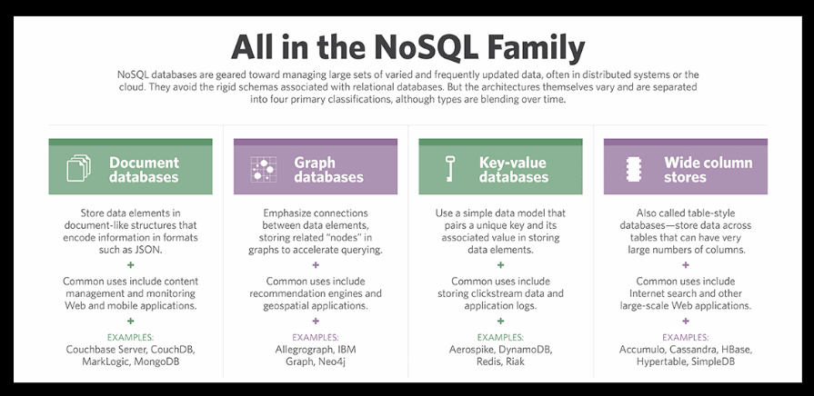

Mongo is a document based database. Keep in mind:

1. Document databases are non-relational
1. More flexible schema than SQL databases, because the client decides how to format the data.
1. The downside of the flexibility is lower data quality down the road.
1. Data in a document may also be grouped and nested, and these are easily accessed. 
    - Though nesting of rows is supported in some tabular databases, they are not very popular due to their complexity.

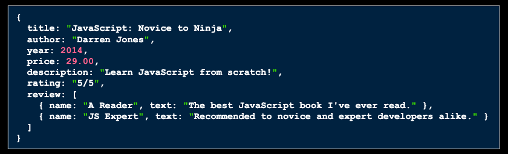

## NoSQL vs SQL

Here is a good article that talks about the differences:

https://www.sitepoint.com/sql-vs-nosql-differences/

A few key points from the article:

    - In a document databases, data can be added anywhere, at any time. There’s no need to specify a document design or even a collection up-front.
    - A NoSQL database may be more suited to projects where the initial data requirements are difficult to ascertain. That said, do not mistake difficulty for laziness: neglecting to design a good data store at project commencement will lead to problems later.

We will be using the NoSQL called MongoDB. Node.js has evolved to work very well with MongoDB (although any SQL database such as Postgres or MySQL would work too)
Some of Node.js's adoption success came because of the launch of MongoDB's connection library called Mongoose (2010-2011).

The success of MongoDB is significant because Amazon (AWS) sees it as a threat.
Amazon recently made DocumentDB, which is meant to compete with MongoDB:

https://aws.amazon.com/documentdb/

Which companies use MongoDB?

https://www.mongodb.com/who-uses-mongodb

## Mongo - CREATE

<u>[Mongo - Insert Documents](https://docs.mongodb.com/manual/tutorial/insert-documents/)</u>

`NOTE:`Please make sure MongoDB is installed before proceeding. 
If you have not installed, please click [here](#install) to be taken to the instructions on how to install.

In order to work with Mongo locally, you need to make sure the process is running in the background. 

Open up your terminal and in any directory, type `mongod` in the command line. This will start the Mongo server. You need to have this running in the background while working with MongoDB. 

`ALERT ->` The #1 issue is forgetting to start the mongod process in the background so if you can not work on projects or have issues, it is generally due to this.

Open up another terminal. You can do this by opening another window or you can just open another tab.

In the command line, type in `mongo`. You should see something like this in your terminal:

This will open the Mongo shell. It is kind of like the JavaScript console, and we can use it to interact with our database(s).

The first command you should become very familiar with is the `show dbs` command. What this does is show you all the databases you have access to. By default, you will have three dbs that you will see:

    - admin
    - config
    - local

These should not be altered in any way at this time.

Below, you will see these defaults as well as 2 other dbs which are associated with this specific user:

    - passport_reactDemo
    - todo_list

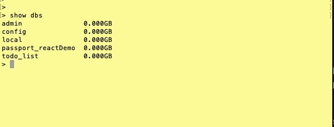

Within each database you can add collections and in turn add documents. However, you need to be able to see which database you are using so you can insert the correct data into the correct collection.

What happens when you type `use class_mates` in the terminal?

What happens if you retype `show dbs`?

You should only see the same dbs that you saw the last time you typed this in? So where is the `class_mates` db?

It is there, but since there is no data in it, it will not display when you use the `show dbs`.

What is the `use <db>`command doing? It is switching to the database you want to start inserting data into. If the database exists you will be able to add data as needed. If the database does NOT exist then by using the `use <db>` command, you are <u>creating</u> that database.

In order to insert data into your database, you will need the `db.(name of collection).insert()` command. This will allow you to insert specific data into the (name of the collection) which is part of the current db you accesed when you executed the `use <db>` command.

So using this command, practice inserting the names of your peers from class into your `class_mates` db.

If `db` refers to the class_mates database referenced with the `use class_mates` command, what do you need for the collections and data?

    - `peers` will be the name of your collectio; this is an arbitrary name but general represents what the collection data contains
    - {fname: '<first name of your peer>', 
        lname: '<last name of your peer>'
      } 
        
        will be the data to be inserted where <name of your peer> is the actual names of one of your peers and make sure it is a string.

Assuming that Joe Average is a peer, you would write your command as the following:

    db.peers.insert({fname: 'Joe', lname: 'Average'})

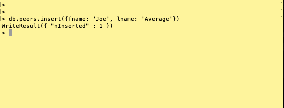

You will notice there is a line displayed as confirmation:

    WriteResult({ "nInserted" : 1 })

This states that there was 1 document inserted into the collection correctly.

If you try the `show dbs` command, you should see all the previous databases and you can also see `class_mates` as it now contains data. But what data does it contain? Where is your collection?

Try the following command:

    show collections

Now you should see 'peers' displayed as this is the only collection you have created within the 'class_mates' database.

## Mongo - READ

<u>[Mongo - Query Documents](https://docs.mongodb.com/manual/tutorial/query-documents/)</u>

As for the data, you can use the following command to see all data inside the specified collection:

    db.peers.find()

This will find ALL documents inside the peers collection.

So what if you needed to add another document:

    - first name - Jill
    - last name - Doe

How would you do it?

And if you do another find, you should see the following:

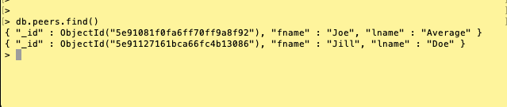

But what if you only wanted the document that contained 'Joe'?

You can use a modified 'find' by passing in the specific search criteria:

    db.peers.find({fname: 'Joe'})

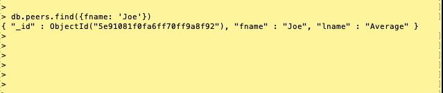

This can get hard to read and decipher as more data is inserted so there is a way to make it prettier by using `.pretty()`:

    db.peers.find().pretty()

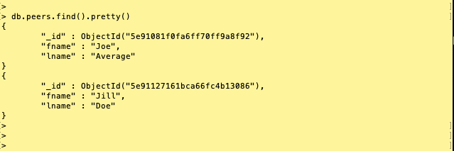

You should see a `name: value` pair now called `_id`. By default, mongodb assigns its own unique id for each document inseted into a collection. It is possible to assign your own value to the `_id` if needed but, it is normally better to let mongodb create the id; that way there is no chance of accidentally creating a duplicate id.

Almost always, you will be passing in an object to give instructions to mongodb.

## Mongo - UPDATE

<u>[Mongo - Update Documents](https://docs.mongodb.com/manual/tutorial/update-documents/)</u>

Now that there is data inside the database, and you know how to read (find) the data, we may need to update the documents. 

What if Jill and Joe get married and now Jill's last name is 'Average'? You need to update your data to reflect this. You can do this by using the `update()` method. It takes two arguments: the first is something to select, and the second is the data you want updated. Try this:

    db.peers.update({fname: 'Jill'}, {lname: 'Average'})

Did you notice the success message returned?

Run a 'find' on your collection. What do you notice?

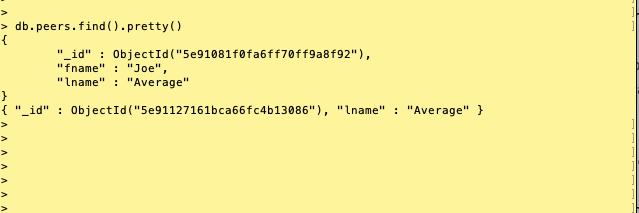

Take a look at the `_id` and compare to previous finds. You should notice that the id is the same BUT the document has changed.

When updating you need to be very specific about what you are updating. By using the command above, you told mongo to find the document that matches `fname: 'Jill'` and update the document so it now ONLY contains `lname: 'Average'`. But what you really wanted to do was update only the last name of the document containing a first name of Jill.

There is another method that is more useful.

For the time being, add another document with 'Jill' for first name and last name 'Doe'.

Now if you want to update the last name we can use the `$set` option:

    db.peers.update({fname: "Jill"}, {$set: {lname: "Average"}})

## Mongo - DELETE

<u>[Mongo - Delete Documents](https://docs.mongodb.com/manual/tutorial/remove-documents/)</u>

You have documents, and collections, and databases. How do you get rid of them?

In order to delete a document, you can use the `delete` method and pass in a filter:

    db.peers.deleteOne({fname: "Jill"})

There is another option - `deleteMany({filter})`. The differences between the two is that `deleteOne()` will delete the FIRST documant that matches the filter criteria whereas `deleteMany()` will delete ALL documents that match the criteria. 

If you need to delete a collection, use the `drop` method with the name of the collection:

    db.peers.drop()

And to delete an entire database, make sure you are inside the database you want to delete. You can use `db` which will tell you which database you are in. (Why not use `'show dbs'`?)

    db.dropDatabase()

### Tutorial:
<h3>TIME REQUIRED - 1 hour 15 min</h3>

Please watch the following Pluralsight videos before proceeding. No coding needed.

`NOTE:`Please ONLY watch sections #1, #4 and #5.

### [Intro to MongoDB](https://app.pluralsight.com/library/courses/mongodb-introduction/table-of-contents)

Please take the following quiz at thsi time:

### [Quiz 15 - MongoDB](https://docs.google.com/forms/d/e/1FAIpQLScQVMIhrhHs1ROJ5QXVK9LueGNi3ussSZBR9rkkd_ygNFL3qw/viewform)

## Mongoose

Now you know how to use basic mongo commands. And this can be done in a shell. But how do you take this information and use it in a way that allows you to work with mongo in an API and with javascript?

You need a way to have our javascript interact with our database, instead of through the shell. In order to do this, you can use Mongoose.js.

Please checkout these two great resources:

[Mongoosejs.com](https://mongoosejs.com/)

[NPM Mongoose](https://www.npmjs.com/package/mongoose)

In order to understand the basics on Mongoose, we should break it down into three parts:

        - connecting
        - blueprints
        - queries

### Connecting

Before you can use javascript to interact with your databse, you have to connect to it. Generally this is done with the following steps:

    1) Installing Mongoose with NPM
    2) Requiring Mongoose

Once you have access to the mongoose instance, you need to build your connection. This is usually accomplished by connecting to:

        "mongodb://localHost:27017/<name of your database>"

By default, Mongo uses port `27017`. This cannot be changed. Since you are building your database locally, you will need to use the `localHost` path. And lastly, you need to add the name of your databse to the path. If the database does not exist, mongo will automatically create the database. 

 `NOTE:` because you are setting the database in the url connection, when you start to write queries, you will not need the `db` you used when working in the shell; the `db` is implied by the name of the database in your connection.

 Once you have your url, you need to use the `connect()` method and pass in the url as well as any options you may need:

        mongoose.connect(<url>, {options})

When in doubt about any options you may need, please refer to Mongoose documentation as well as the terminal. Oftentimes, any changes or communication from your modules will be seen in the terminal during run time.

As of 4/2020, what options do you get in your terminal when you run your app? 

As mongoose is promise based, you can chain `then()` with a console log to indicate to the developer that the databse has been connected to. 

        mongoose.connect().then()

Or you can use a callback (cb) function:

        mongoose.connect(url, options, cb(){})

### Blueprints

The best way to get accustomed to using documents and mongoose, is to understand `schemas` and `models`.

Think of schemas as the actual blueprints of how you want your documents to look. For instance, if you know you are going to have a document that includes a first name as a string, last name as a string, age as a number, loyalty member as a boolean, you would have a blueprint that looks somethng like this:

        {
            fname: String,
            lname: String, 
            age: Number,
            member: Boolean
        }

As you see, the blueprint is an object.

Next, you want to pass this blueprint into the `Schema()` method of mongoose:

        mongoose.Schema({
                fname: String,
                lname: String, 
                age: Number,
                member: Boolean
            })

Next you want to assign a `new` instance to a variable that can referenced when you build your model. Generally, the variable is written in a way that represents the blueprint object. As your current object represents a member and their data, `memberSchema` is a reasonable choice:

        let memberSchema = new mongoose.Schema({
                                    fname: String,
                                    lname: String, 
                                    age: Number,
                                    member: Boolean
                            })

This will be discussed later during class, but please keep in mind that even though you have set your schema up with 4 name:value pairs, and described the expected data types, this does not mean every document you create will have all those values nor do the data types have to match. 

The other blueprint you need to build is the `model`. This is done by using the `model()` method of mongoose and passing in the schema you want as well as the name of your collection. The syntax will look similar to this:

        mongoose.model("Name of your collection", schema)

The syntax is important. For example, if the name of your collection is `peers`, the way you would pass it to your model is `"Peer"`. This is just a naming convention, but generally, the name of the collection is capitalized and singular. Later on, when you check in Robo3T or you r mongo shell, you will notice that even though you used `"Peer"`, Mongoose converted it into `peers`. 

Again, this is just a naming convention, but whatever you decide, be consistent.

As for the schema, this would be the schema you want to assign to that collection. In your case, if you were using the memberSchema with the peers collection, your model would look like this:

        mongoose.model("Peer", memberSchema)

Lastly you need to assign this model to a variable that will be used with your queries. As per best practices, the variable is often the same as the collection passed into the model. Hence, our completed model would look like this:

        let Peer = mongoose.model("Peer", memberSchema)

### Queries

Mongoose uses queries which are very simliar to those used by mongo. A few of these are `.find()`, `.update()`, `.deleteOne()`, as well as others used in class and demos. However, there are many more queries that can be simplified with mongoose that would require more lines of code in mongo.

There are also other methods that you will need to ensure security and performance. One such method is `.disconnect()`.

When you start your app, you use the connect() method. At some point, you are going to need to disconnect from the database and you can do this with:

            mongoose.disconnect()

As for actual queries, here is a great reference:

[Mongoose Queries](https://mongoosejs.com/docs/api/query.html)

The syntax for most queries followingt he same pattern. But please refer to the above documentation for more specific uses.

The syntax looks like this:

        model.query(function(err, result){
           // write some code
           // generally testing for an error first
           // if no error, then do something
        })

Using our Peer model from above and wanting to find ALL documents in the peers collection, you would write something like this:

        Peer.find(function(err, results){
            if(err) {
                console.log('There has been an error searching: ', err)
            } else {
                console.log('Here are your results: ', results)
            }
        })

### [Quiz 16 - Mongoose](https://docs.google.com/forms/d/e/1FAIpQLScVZ01w42Wqz8_luD41eJmbhn1CW1Y3fwcD88nFaxmZAbpUgw/viewform)

<!-- 1. [Intro to Mongo/Mongoose](https://docs.google.com/presentation/d/1jughCDyOD3lwUy9yIWg-dVLReinG7eAwRL79RqYtP4I/edit?usp=sharing)
2. [Robo3T/ToDo App](https://docs.google.com/presentation/d/16RIhpqwTxtVob-QBvbQbRe1QlJeUGJAfCINJD8u-NbA/edit?usp=sharing) -->

#  PROJECTS

Before you go any further, PLEASE review these pages on how to install Mongo on your OS.

Please install the Community Edition. Also, you will need to follow installation procedures for MongoDB as a Windows Service or macOS service.

<!-- 1) Watch video Walkthru
2) Go through the Instructions with the video
3) Then watch the video AGAIN and install as instructed

`NOTE:`Those who have followed these guidelines have had an easier time installing Mongo than those those who attempted their own way. -->

<!-- * [Video Walkthru of Installation - Manny](https://drive.google.com/file/d/1347d5_-X-LOrettDE1vpSqqU4gVDVx34/view?usp=sharing) -->
* [Instructions for Windows](https://docs.mongodb.com/manual/tutorial/install-mongodb-on-windows/)

<!-- * [Video Walkthru of Installation - Piyush](https://drive.google.com/file/d/1P_CF2Alf3e4jmQU5FiMdq7h2hcmMwdUI/view?usp=sharing) -->
* [Instructions for Mac OSX](https://docs.mongodb.com/manual/tutorial/install-mongodb-on-os-x/)

For Mac users who updated to Catalina, please refer to the following for possible further instructions: https://zellwk.com/blog/install-mongodb/

INSTALL Robo3T (NOT Studio or the Double Pack) at following link: 

[Robo3T](https://robomongo.org/download)

You should see somethng similar to the following:
 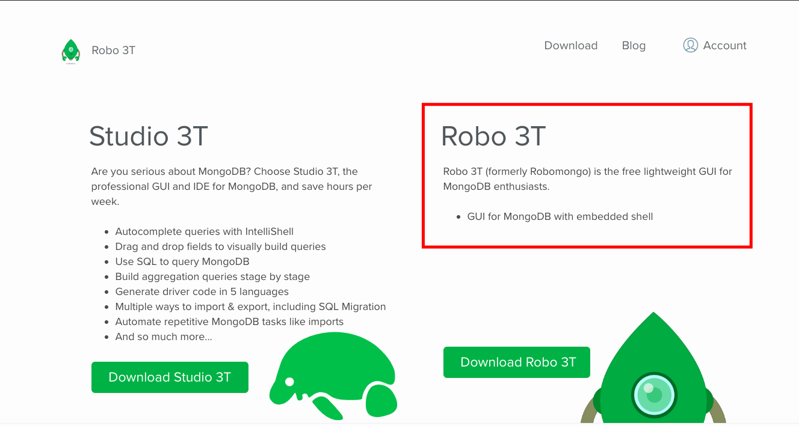

1. Note about installing MongoDB: You may run into an error that says “mkdir: /data/db: Permission denied”. If this happens, try running “sudo mkdir -p /data/db” and entering your password: http://i.imgtc.com/xnEY5DO.png

    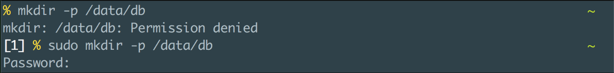

2. OPTIONAL - based on how install was completed:

You will know that you’ve got it working when you run “mongod” in your terminal and get something that looks like this: 

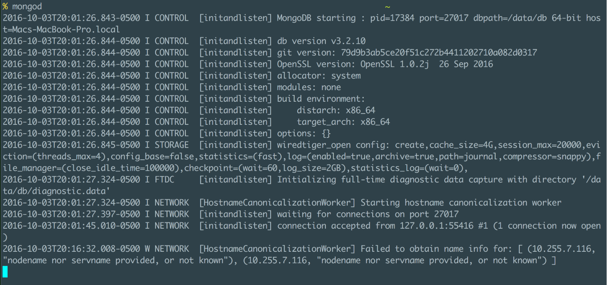

3. This is the Mongo daemon, and it starts the mongo server. You will want to keep it running in the background when working with MongoDB. Open a new tab in the Terminal and run “mongo”:

    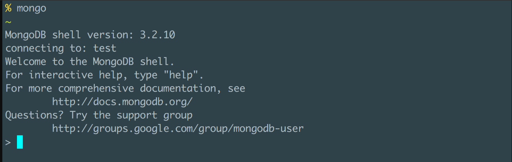

4. This is the Mongo shell. It’s kind of like the JavaScript console and we can use it to run commands in Mongo. You can refer to this list for commonly used commands: 

    [MongoDB](https://docs.mongodb.com/manual/reference/mongo-shell/)

<!-- 5. If none of the above work, you can use Robo3T and open the shell inside there and use like we did in class. -->

## Project 1:
1. How do you start mongo shell?
1. How do you determine which databse is currently being used?
1. Create a database called comics.
1. Insert the following documents into a collection called `dc`:

    {alias: 'Superman', fname: 'Clark', lname: "Kent", nemesis: 'Lex Luthor', hero: true}

    {alias: 'Batman', fname: 'Bruce', lname: "Wayne", nemesis: 'Joker', hero: true}

    {alias: 'Joker', fname: 'Jack', lname: "Napier", nemesis: 'Batman', hero: false}

    {alias: 'Catwoman', fname: 'Selena', lname: "Kyle", nemesis: 'Batman', hero: false}

1. Find all characters and sort by alias.
1. Find all characters who have Batman as their nemesis.
1. Find all characters who are heroes?
1. Find all characters who are a hero, but show alias only.
1. Find all characters who are a hero, but show everything BUT their alias.
1. Catwoman started dating Batman, and now is considered a hero. Update her hero status? (HINT: make sure nothing else changes)
1. Catwoman broke up with Batman, she is a villain again. Update her hero status? (HINT: make sure nothing else changes)

1. Batman adopted a son named Jason Todd.  Add a new field to his document. You want to add a field called children and it is an array of objects with age, fname, and lname of the child.

    Use your mongo shell:

        var children = [
            {
                age: 13,
                fname: 'Jason',
                lname: 'Todd'
            }
        ]
    
    Then update as needed. Make sure nothing else changes with the document.

1. Superman decided to adopt the Wonder Twins:

        var children = [
            {
                age: 18,
                fname: "Zan",
                lname: "Fleming"
            },
            {
                age: 18,
                fname: "Jayna",
                lname: "Fleming"
            }
        ]

    Insert their fields to his document.

1. Catwoman had a daughter named Helena Wayne:

        var children = [
            {
                age: 17,
                fname: 'Helena',
                lname: 'Wayne'
            }
        ]

    Insert her fields into her document.  

At this point, you should have the following when you do a find:

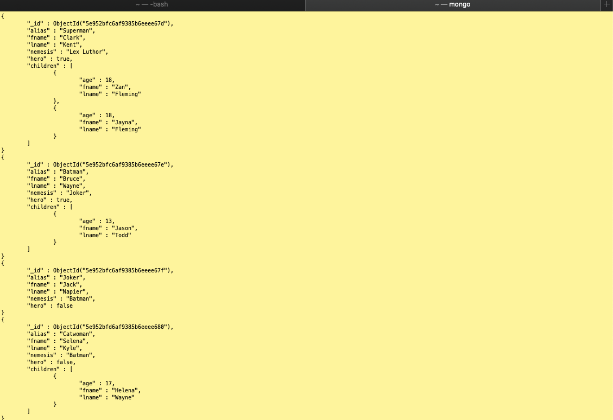

15. How do we find those heroes with children under the age of 18?

1. DC comics filed for bankruptcy, so we can delete the whole database.

## Project 2:
Create a new folder and install Mongoose. http://mongoosejs.com/index.html

1. Create a database called `app_users`. Let us pretend that we are creating a database for users of our fictional app.
1. Create a schema that has three pieces of data: username (string), age (number), and favorite_pizza (string).
1. Create the model. 
1. Then create a customer named ‘Nancy’ who is 22, and has a favorite pizza of pepperoni.
1. Save this to the database. 
1. Confirm that it works by querying it in the MongoDB shell.
1. Comment out your code that created the Nancy document
1. Create another customer, this time you only know their name is Tommy and they like veggie pizzas.
1. Confirm that it works by querying it in the MongoDB shell. What did you notice, or expect to happen?
1. Update your schema code so that there is default date type value assigned to a key called `created`, a key called `member` which is a required boolean and has a message if this requirement is not met. Click here for help: https://mongoosejs.com/docs/schematypes.html
1. Try to add Tommy again. What happens? What errors are you getting?
1. Can you drill down so the error message you wrote in the schema is displayed in your console instead of the entire error?
1. Update your document creation code so it does not violate schema requirements.
1. Run your code. Did your document pass schema validation? 
1. Verify in your mongo shell (or Robo3T). Did you notice anything different about your document? HINT: how many key:value pairs are there? How many did you actually create yourself? How many were done by mongoose?

References: 

https://stackoverflow.com/questions/12495891/what-is-the-v-field-in-mongoose

https://mongoosejs.com/docs/schematypes.html

https://coursework.vschool.io/mongoose-crud/

## Project #3 - ToDo App with Mongo and Mongoose

We are going to convert our previous semi-persistent todo app into an app that will save our data permanenetly.

Please research the following before trying to convert your app: 

1) [Mongoose](https://mongoosejs.com/)
1) [Schema Types and validation](https://mongoosejs.com/docs/schematypes.html)
1) [findById()](https://stackoverflow.com/questions/12483632/mongodb-via-mongoose-js-what-is-findbyid)
1) [findByIdAndDelete()](https://docs.mongodb.com/manual/reference/method/db.collection.findOneAndDelete/)

## Project #4 - BONUS

### Tutorial
<h3>TIME REQUIRED - 1 hour 20 min</h3>

Please continue with watching the previous Pluralsight videos. No coding needed.

`NOTE:`Please ONLY watch sections #2, #3 and #6.

### [Intro to MongoDB](https://app.pluralsight.com/library/courses/mongodb-introduction/table-of-contents)

## RESOURCES

### Additional Self Learning

1. Review these pages on how to work with the documents

    [Read & Write (CRUD) Operation](https://docs.mongodb.com/v3.0/core/crud-introduction/)

2. Review how to model data stores in Mongo as follows

    [Mongo Data Models](https://docs.mongodb.com/v3.0/core/data-modeling-introduction/)

3.   You Tube resource:

        [MongoDB in 30 Minutes - Youtube](https://youtu.be/pWbMrx5rVBE)

<!-- ##### Note: The instructor's installation and execution method varies slightly from what we will use in class.  You may follow either one.  Neither one is more correct than the other -->
