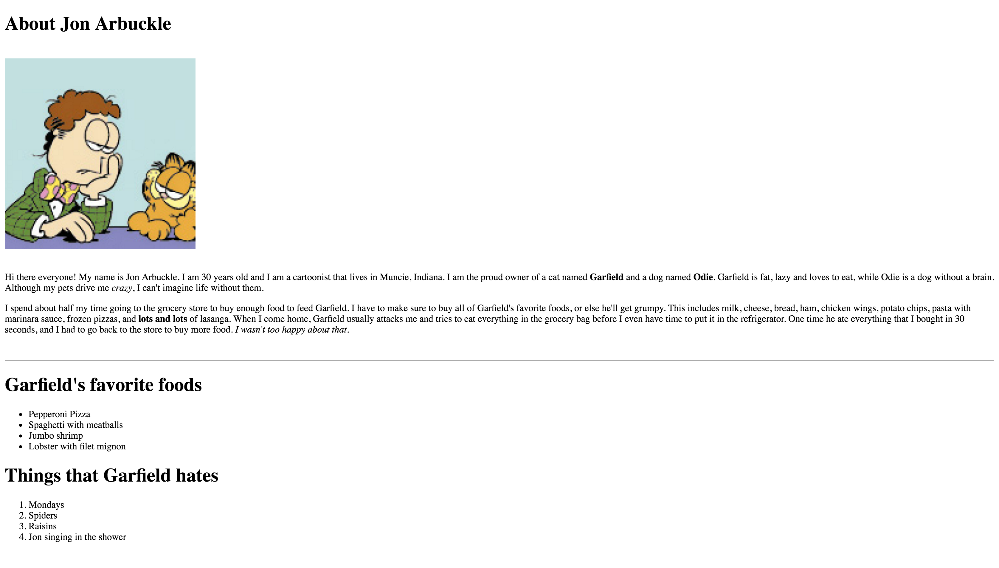
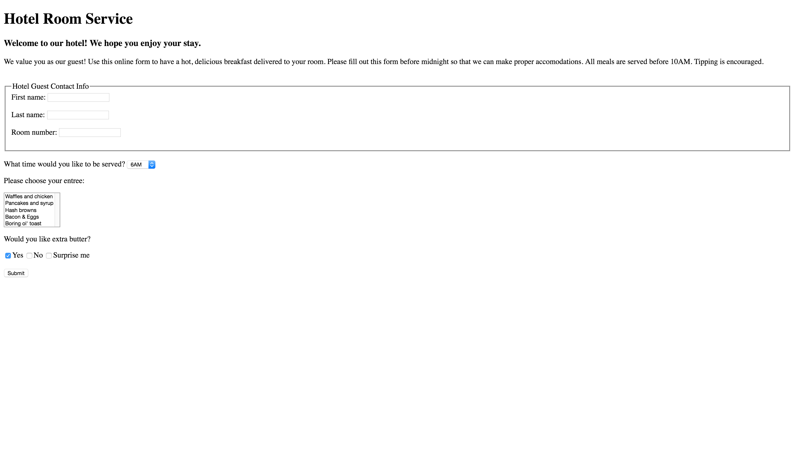

<center>
 
### AUSTIN COMMUNITY COLLEGE 
#### Web Software Bootcamp

</center>

# GOALS

## Command Line

There is no submission for these projects.

### Project #1

#### Learning Goal

How to manage your files on ** command line **

1. On your desktop, create a folder named “soups”.
2. Go inside of your soups folder. Create a file called “ChickenNoodle.html” and “BakedPotato.css”
3. While you’re inside of the soups folder, create another folder called “js”.
4. Go inside of the js folder. Where are we? Display the current path that we are on.
5. Now go back to the soups folder.
6. Create a file called “CreamyTomato.js” and put it in the js folder while still in the soups folder.
7. Create a file called “readme.txt.” in the soups folder.
8. On second thought, maybe we don’t need a readme file right. Delete “readme.txt”.
9. Go into the js folder.
10. You decide you’re not in the mood for creamy tomato. Rename “CreamyTomato.js” to “BroccoliCheddar.js”.

**You’re done!**

### Command Line Project #2

#### Learning Goal

<b>Note:</b> for this project, you cannot use the “cd” command. Do everything from the desktop path of your command line.

1. On your desktop, create a folder called “drinks”.

2. Inside of drinks, create three folders: Smoothies, FrozenDrinks and IcedSpecialtyDrinks.

3. Rename the “Smoothies” folder to “PowerSmoothies”.

4. Inside of PowerSmoothies, create three files: 
    1. PeachAndBlueberry.txt, 
    2. GreenPassion.txt, and 
    3. Superfruit.txt.

5. Inside of FrozenDrinks, create three files: 
    1. WatermelonStrawberryLemonade.html, 
    2. Caramel.html, and 
    3. Mocha.html.

6. Inside of IcedSpecialityDrinks, create four files: 
    1. CaramelLatte.css, 
    2. ChaiTeaLatte.css, 
    3. CaffeMocha.css, and 
    4. CaffeLatte.css.

7. Delete CaffeLatte.css. 

That’s enough caffeine for today!

### Command Line - Project 3

#### Please answer the following questions.

1. What command would you use to clear the screen?

2. What is the shortcut command to open a new tab in your terminal?

3. What key would you use to scroll through previous commands you’ve typed before?

4. You have a three txt files and an empty folder on your desktop. Write a single line command that will move all three txt files into the folder.

5. You want to inspect the differences between two txt files myfile1.txt and myfile2.txt. Write a command that would display the differences in content between these two files.

6. Write a command that would delete this folder and all of the contents inside.

7. What is the command to list all files, including hidden files?  Write a command that displays all .css files in a folder.

8. What is the command to find a file by name on your disk (or some other storage medium)?

9. What is the command to find a file by content
    
    1. in your folder 
    2. on the disk?  
  
    That is, how do you search for a word or phrase in the file contents?

10. Use a bash command to create a file named YourName.txt with no content in it.  Look at it's permissions.
  
    1. Now change its permissions so everyone can read it and execute it.  
    2. Now change its permissions so only you can read it.
    
## HTML

#### Slides 

  [HTML Intro](https://docs.google.com/presentation/d/1-9V2BBD74m7GjFewjOnlRWY8y0--hRKCWOVodbUOAM4/edit?usp=sharing)
  
  [HTML Tables, Forms](https://docs.google.com/presentation/d/1tsi8GqRWjoADTmVJKFd7a4Rw1uN1XztSbYroA1stXz0/edit?usp=sharing)

  [HTML Accessibility and Engineering Empathy](https://docs.google.com/presentation/d/15YqgOBNO-6qFcoyCNba9B5yYtT5TgDSMpZT87W9tJik/edit?usp=sharing)

  
  
 #### MDN HTML Intro

  The following Mozilla Developer Network is an excellent, authoritative introduction to building web pages using HTML.  It covers issues that you need to know as a developer and many HTML Introductory Courses skip over.
  
  [Mozilla Developer Network HTML Introduction](https://developer.mozilla.org/en-US/docs/Learn/HTML/Introduction_to_HTML/Getting_started)

1. [Front End Developer Bootcamp](https://codervox.com/p/the-front-end-developer-bootcamp/?product_id=1218866&coupon_code=100PERCENTOFF72019)

Please check out this online tutorial above, by our own Jonathan Lue.

Focus on **Section 5** - HTML


# HTML Projects    

## Instructions

Your task is to re-create from scratch the websites that you see from the screenshots/videos. Each project is it’s own individual website which may have one or more pages. Detailed instructions for each project are listed below. Good luck!

### Project 1 - Jon Arbuckle

<b>GOAL:</b> build a basic website with HTML

This is the home page of Jon Arbuckle, a cartoon character who owns a cat named Garfield.

When building this site, keep in mind that you:

- Must use the br and hr tags
- Must use the h1, u, strong, em, and p tags
- Must create two lists: one ordered, and one unordered
- Use the following images:

    [Jon Arbuckle Image](./project_assets/Project1/jon-arbuckle.png)


When completed, it should look like this:




### Project 2 - Steve Jobs Fansite

<b>GOAL:</b> How to link files and external websites

This project will help you gain experience in writing links in HTML by building a website devoted to the founder and former CEO of Apple Inc., Steve Jobs.

- Use the following images:

    [Steve Jobs Image](./project_assets/Project2/steve1.jpg)

The text on your page should be connected to the following links:

- [Steve Wozniak](https://en.wikipedia.org/wiki/Steve_Wozniak)

- [Apple II](https://en.wikipedia.org/wiki/Apple_II)

- [Pixar](https://en.wikipedia.org/wiki/Pixar)

- [Steve was a fantastic salesman](https://en.wikipedia.org/wiki/Reality_distortion_field)

- [Remembering Steve](http://www.apple.com/stevejobs/)

- [The Steve Jobs Biography](https://www.amazon.com/Steve-Jobs-Walter-Isaacson/dp/1451648537)

- [The Steve Jobs Movie](http://www.imdb.com/title/tt2080374/)


There are three YouTube videos at the bottom the page. Here are the links:

- https://www.youtube.com/embed/upzKj-1HaKw
- https://www.youtube.com/embed/jcFbGsl8DDI
- https://www.youtube.com/embed/5fI3zz2cp3k


The completed site would look similar to below (images may be different based on YouTube links)...


### Project 3 - Breakfast Restaurant

<b>GOAL:</b> Using forms

You are going to build a website for a restaurant that only serves breakfast.

The idea is to practice linking between separate files, as well as accessing files located in different folders.

Requirements:
  - three separate html files
  - a folder called `assets`
  - all your images need to be downloaded inside your assets folder. Use the following images (right click and choose Save Image As):

  - Page 1 - Food
    

  - Page 2 - First Image
    

  - Page 2 - Second Image
    

  - Page 2 - Third Image
    

  - Page 2 - Fourth and Last Image
    


The completed pages would look like this...

#### Page 1 - The Breakfast Restaurant


#### Page 2 - The Menu


#### Page 3 - Contact Us


### Project 4 - Hotel Room Service

<b>GOAL:</b> Using more types of forms

A simple form page for a hotel that allows the guest to order a hot, delicious breakfast in the morning.

The drop down box next to “What time would you like to be served?” should display 6AM, 7AM, 8AM, 9AM and 10AM.

The finished page should look like ...



### Project 5 - Become a Programmer

<b>GOAL:</b> Using tables and inline resizing of images

You are going to build a website that describes the benefits of being a programmer. This project will gain you experience in HTML tables.

Requirements:
    
  - use two tables
  - create a folder called `assets`
  - all your images need to be downloaded inside your assets folder. Use the following images:

    [San Francisco](./project_assets/Project5/sanfrancisco.jpg)

    [Honolulu](./project_assets/Project5/honolulu.jpg)
    
    [Los Angeles](./project_assets/Project5/LosAngeles.jpg)

The finished page should look like ...


## FOLLOW UP:

When writing HTML, please run validation on it. You can use the W3C Markup Validation Service online [here](https://validator.w3.org/#validate_by_upload)
  
Another decent validator is a Chrome extension called HTML Validator.  Once enabled, it shows your mistakes in the Validator tab in Dev Tools. You may find the plugin [here](https://chrome.google.com/webstore/detail/html-validator/mpbelhhnfhfjnaehkcnnaknldmnocglk?hl=en-US).


# BONUS MATERIALS/RESOURCES

### 1. HTML Forms
  [W3Schools](http://www.w3schools.com/html/html_forms.asp)

### 2. How to structure an HTML form
  [Mozilla Developer Network](https://developer.mozilla.org/en-US/docs/Web/Guide/HTML/Forms/How_to_structure_an_HTML_form)

### 3. Github Flavored Markdown
  [How to create rich formatted files that are all text and can be compared to previous versions?](https://help.github.com/articles/getting-started-with-writing-and-formatting-on-github/)

### Trying to Understand Git?  

1. **Git Reference**
  
    You must check out the https://git-scm.com/ website.  It has a lot of really good learning resources.  Don't try to learn all of it at once.  It is overwhelming.
  
    Also, make a book mark and check out the Git e-Book.  I found this to be a great way to learn quickly.
  
    https://git-scm.com/book/en/v2

    Don't fret.  It will take a review of Git from many angles to finally grok it.  For this week, read some excellent explanations [here on StackOverflow](http://stackoverflow.com/questions/3329943/git-branch-fork-fetch-merge-rebase-and-clone-what-are-the-differences/).  Don't worry if you don't understand EVERYTHING on this discussion.  


2. **Fetch and Pull**

    A good topic for research and discussion with the class, is the question of what's the difference between ```git pull``` and ```git fetch```.  Try it. 


  
## Job Search

The following publication from LinkedIn University as some good tips about job search. I liked their simple tips for creating your LI profile.

[Review Job Hunting Handbook, by LinkedIn, Vol 1](https://university.linkedin.com/content/dam/students/global/en_US/site/img/StudentPublishMicroSite/pdfs/LNK_MM_JobSeeker_eBook_StudentEdition_Sec1_FINAL.pdf)

**Blogging**: 

It is a great tool to prove that you know your stuff.  
  - Search for top rated blogging providers, select one and start your blog.  Some of them are tumblr, [Blogger](https://www.blogger.com
), blogspot, medium and wordpress.com.
  - Create your blog about your Bootcamp Learning Journey. Share it with others.
  - Post an entry every week or 10 days.
  - Blogging ideas
    - Documenting my journey as a Newbie Developer.  Remember that thousands of folks are undertaking this journey everywhere.  Make it useful for them.
    - Setting up my Development Environment.  Your dev environment is one of the most critical assets you have.  And this is not going to be static.  It will evolve along with your evolution.  Keeping a running blog acts as a dignified note of what you are using, why and how are you establishing your development workflow.
  

