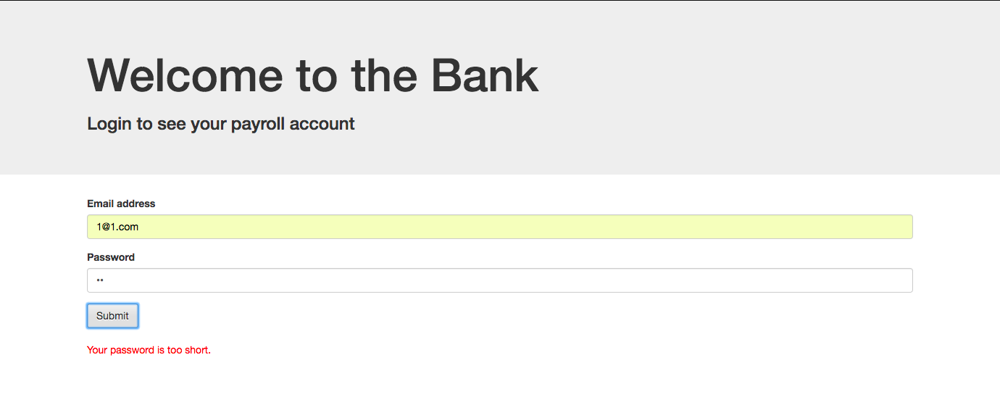

### AUSTIN COMMUNITY COLLEGE 
#### Web Software Bootcamp 

# LEARNING GOALS
We'll be learning jQuery for about a week. It's a JavaScript library that will help us with DOM manipulation.

## The DOM

Understanding the Document Object Model is foundational for web programming.  We'll talk about the DOM in 
class.  For a more detailed look at how a DOM is represented in memory and rendered on the browser, review
this online tutorial

[Understanding the Document Object Model](https://channel9.msdn.com/Series/Javascript-Fundamentals-Development-for-Absolute-Beginners/Understanding-the-Document-Object-Model-13)

## Slides

1. [jQuery - intro](https://docs.google.com/presentation/d/1TaRCNwo4oODFcD6JdOZnCi_GtKo8T3FwBmel_aNtW9g/edit?usp=sharing)
1. [jQuery #2](https://docs.google.com/presentation/d/1s4MtEJM3m-g2yxilg6G6qkcLKqnd94qpb_VpmcVBHn0/edit?usp=sharing)
1. [jQuery #3](https://docs.google.com/presentation/d/1HufxfGlunIMp5RADFccvy-4TTynNK4XBfpjy3q906Cc/edit?usp=sharing)
1. [jQuery - UI](https://docs.google.com/presentation/d/1f3kKpxaz96rnDz_TmqQt0t2sp08QOXJS1QExdHjp44A/edit?usp=sharing) - TBD, otherwise an introduction to jQuery UI - animations and other interesting user interfaces

## Self Learning

<h3>TIME required - 1 hour 40 min</h3>
Great way to get your feet wet with jQuery: 

[jQuery: Getting Started](https://app.pluralsight.com/library/courses/jquery-getting-started/table-of-contents)

AFTER you have watched the tutorial above, please take a look at the following:

[jQuery In-Depth from jQuery](https://learn.jquery.com/)

Use this resource as a reference.  When in doubt, you should refer to this resource, or ask an instructor.

Below are two other resources. Both are very credible sources and have done a good job for students in the past. 

  [Getting Started with jQuery from Channel9 at MSDN](https://channel9.msdn.com/Series/Javascript-Fundamentals-Development-for-Absolute-Beginners/Getting-Started-with-jQuery-14)

or, if you prefer a text book format, you may use

  [JQuery Novice to Ninja - PDF](https://drive.google.com/file/d/1dySEW1N6QevsBrqPQaOGXy4gDjx8fcwp/view?usp=sharing)

#  PROJECTS

#### Project 1: Parallax and Particles.js
Let’s take our front end design skills to the next level!

There are a ton of really cool and interesting jQuery plugins that add functionality to your websites. The parallax effect is something that’s been used in a lot of news websites.

We’re also going to use particles.js to create a cool animation effect: https://github.com/marcbruederlin/particles.js

Check out the site for parallax.js: http://pixelcog.github.io/parallax.js/

Your task is to create a SINGLE page site that implements both of these plugins with the following images: 

[City Image](./assets/1.jpg)  

[Traffic Image](./assets/2.jpg)  

Read the documentation and familiarize how to use them. Use bootstrap for styling alignment of the text, and font awesome for the icons.

Here is an image (compilation of 3 screenshots) the project: 

#### Project 2: jQuery Form Validation

We’ve done form validation before, and now we’re going to do it again with jQuery.

You’re going to create a form with two fields: email and password. If an incorrect email is entered, a message in red is displayed that says 'You must enter a valid email.' If the password is shorter than 6 characters, it will say 'Your password is too short.'

* 
* 
* 
* 
* 

For this project, you will be using a little bit of Regular Expressions in order to validate the user’s email address. While you don’t need to write your own expression (you can just go a Google search for one), this would be a good idea to familiarize yourself with what Regular Expressions are and how they work: https://developer.mozilla.org/en-US/docs/Web/JavaScript/Guide/Regular_Expressions

Note: you will also want to disable Chrome’s built-in email validator by adding the ‘novalidate’ attribute to your form tag (otherwise theres no point to this project!):  http://stackoverflow.com/questions/16269075/disable-remove-the-default-input-type-email-validation-text-overlay-in-fire

# Advanced Concepts

Want to learn more about what jQuery can do:

1. [jQuery User Interface](https://jqueryui.com/)
2. [40 Great tools/tricks with jQuery](https://www.webfx.com/blog/web-design/40-exceptional-jquery-interface-techniques-and-tutorials/)
3. [W3Schools](https://www.w3schools.com/jquery/default.asp)
4. [Turn.js - book effects](http://turnjs.com)
