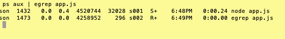
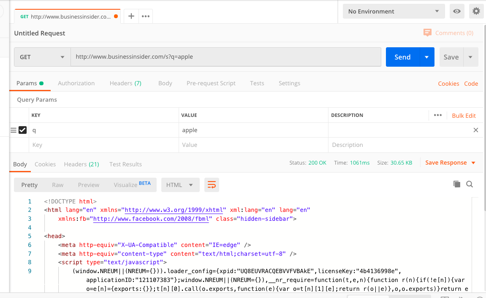

### AUSTIN COMMUNITY COLLEGE 
#### Web Software Bootcamp 

# NODE

# Objectives

1) How the Internet works
1) Introduction to NodeJS
3) Understand the request/response cycle
4) Introduction to Node Package Manager and node modules
5) Install Express.js
6) Build a server
7) Introduction to routing
8) Importance of package.json
9) Killing processes
10) Practice building servers and route handling
11) Using Postman to test data

## How the Internet Works

We’ve reached a milestone having covered the topics in front end technologies! Now, we are going to explore the other side of the stack, namely back end technologies.

<h3>TIME required - 10 minutes</h3>
In order to get a rough idea on how the internet works, watch the following video: 

[Packet: How the Internet Works](https://www.youtube.com/watch?v=ewrBalT_eBM)
 
 
Surprisingly enough, as web developers we don’t need to know the nitty gritty details of how the internet works. Things such as networking layers, data transfer protocols, the TCP/IP stack, etc. are things we don’t immediately need to know. There are whole courses and majors that are dedicated to these topics. However, we do need to know more than the average internet user.

When a user types an address into a browser, such as google.com, they are actually making a request for a website. This is known as an HTTP request. 

When a client (e.g.  a web browser or a mobile app or an IOT device), makes a request to a server, the contents of the response are then sent back to the computer that made the request. This is known as the request-response cycle.  The client makes a request, and the server sends a response.

Take the following as an example: a user searches on www.google.com	

When the user types in a URL, the first thing that happens is that your computer needs to know the exact internet protocol (IP) address to send the request to. 

All IP addresses are unique, just like postal addresses in cities and countries. The DNS takes the domain name (in this case, google.com) and translates it into an IP address: <b>23.543.35.769</b>

Your request finds the fastest path possible to the server with the specified IP. As noted in the video, this is not a direct journey. It requires hopping from server to server until we arrive at the location we requested. 

Once the request reaches the server, the server will figure out what we’re asking for: Are you asking for the home page? The sign up page? Contact page? 

The server’s job is to figure this out and then builds us the right content, often pulling information from a database. The server responds with any combination of HTML, CSS, and JavaScript. 

Below, you will notice different languages used on the back end:

Another example can be seen here:

Think of the workflow like this:

But how do we initiate this workflow? How do we handle the data once it gets back to the front end?

Take a look at stackshare.io in order to see how what types of technology stacks companies use:
https://stackshare.io

Specifically, take a look at the following:

https://stackshare.io/airbnb/airbnb

https://stackshare.io/pinterest/pinterest

https://stackshare.io/netflix/netflix

Notice anything? Recognize any of the technologies? You should see some of the same technologies you have been learning as well as a few you will learn in the near future.

## Node

But now we are going to focus primarily on the back-end and in order to do this, we are going to use Node which will allow us to build a full stack product.

NodeJS is a program that allows JavaScript to run on a computer (the server). So far we have seen Javascript running on a browser. Running Javascript on a back end server allows us to serve dynamic web pages, communicate with other servers, e.g. other websites and database servers, and generally act as a glue for the whole system.

 

        Node.js is currently the hottest, trendiest thing in web 
        development. Remember, JavaScript originally was 
        only designed to be run in a web browser only. 
        Inventor Brendan Eich didn’t expect it to evolve 
        into this massively used language

   

 

Fast forward to 2009. Node.js is invented by a programmer named Ryan Dahl. Node.js allows us to use JavaScript on the back end, thus saving us the trouble of learning another language. This is a HUGE advantage. Before then, you had to use a language like Python, PHP, or Ruby on the back end.

     
Take a look here  (https://madnight.github.io/githut/#/pull_requests/2019/3) and see what the top language is:

### Tutorial
<h3>TIME REQUIRED - 1 hour</h3>

Please watch the following Pluralsight videos before proceeding. No coding needed:

### [Node - the Big Picture](https://app.pluralsight.com/library/courses/nodejs-big-picture/table-of-contents)

#### NEXT: 
<!-- Before we can continue, we need to install Node. Go to the following and download the LTS (Long Term Support) for your current OS:

https://nodejs.org/en/download/ -->

Also, for reference, you may want to bookmark the following site:

https://nodejs.org/en/docs/

## ES6
In learning about Node and related technologies, we are going to use modern Javascript features which are collectively called ES6.

ES6 refers to version 6 of the ECMA Script programming language. ECMA Script is the standardized name for JavaScript and ES6 is the next version after what is called ES5 or Version 5 which was released in 2011.

ECMAScript, or ES6 standards were released in June 2015. They were subsequently renamed to ECMAScript 2015. ES6 is a major enhancement to the JavaScript language, and adds many more features intended to make large-scale software development easier.

Refer back to these lecture slides for a refresher on basic ES6:

### [JavaScript - ES6, Review, and More](https://docs.google.com/presentation/d/1xLBKQhwwsefC5bO1ffOunQdMyQx0Z6rjLyi_n0gQw8I/edit?usp=sharing)

Then watch this tutorial:
<h3>TIME required - 1 hr 45min</h3>

### [ES6 in your Node application](https://app.pluralsight.com/library/courses/nodejs-es6-web-apps/table-of-contents)

## NPM
NPM is a package manager for JavaScript, and it is a central part of Node.js. It is an acronym for Node package Manager.

Packages are libraries that we use on Node.js. It is essentially the same idea as using Bootstrap or jQuery, except this allows us to use libraries on the back end.

All the packages are centralized at the NPM website. You can sort of think of it like the app store for Node packages.

There are over 200,000 packages available (for free!).

Everything is installed through the command line.

Check out the site: https://www.npmjs.com/ 

Watch this Pluralsight tutorial:
<h3>TIME REQUIRED - 30 min</h3>

### [Using Node modules and NPM](https://app.pluralsight.com/interactive-courses/detail/920e0d3b-64a9-49ab-92d5-83ddf1efaa1a)

When ready, please take the following quiz:

### [Quiz 7 - Node](https://docs.google.com/forms/d/e/1FAIpQLSfxvRAYyC6LMnIiWyiPid3LVvF1JakZXawCVi2SYN6dIrVNTg/viewform)

## Node server and HTTP:
For informational and concept purposes ONLY (please do not write code unless you really want to), please watch Sections 1, 2 and 5 of the following tutorial:

<h3>TIME REQUIRED - 45 min</h3>

### [HTTP with Node](https://app.pluralsight.com/library/courses/http-with-nodejs/table-of-contents)

## Express.js
Now that you have seen how to build a server with built-in Node functionality, there is an easier way: Express.js.

Express is the most popular Node web framework. It is going to be the backbone of our web applications going forward. It provides functions for pretty much everything you need to do to build a web server.

Express handles things like cookies, parsing the request body, forming the response and handling routes. It is minimalistic, versus some frameworks that give you way too much code to work with (such as Ruby on Rails).

Why is too much code in a framework sometimes not a good thing? This potentially 
could be problematic because some beginner developers do not understand what is going on under the hood.

Head over to https://expressjs.com/ for more on Express.

With Express, we are going to build a back-end server that will allow us to handle routes:

A better way to understand this is to go through the following tutorial. Again, no coding necessary unless you want to. Also, we will go through routing, templating, and APIs in more detail later.

<h3>TIME REQUIRED - 45 min</h3>

### [Node with Express Tutorial](https://app.pluralsight.com/interactive-courses/detail/541621a6-41b4-4b05-943a-337a1d90fbb5)

******   FYI - the <b>Request</b> module is soon to be deprecated. What this means, is that you can still use it but they are not making any changes to it in the future. That is ok, it is still out in the workplace so it is important to understand how it works. You will be using Fetch to run our HTTP requests and later on we will look at how to use request.  ******

When building a server, think of it in three parts: 

    Foundation: this is where you require your modules and set most of your global variables and anything else that will be needed for route handlers

    Route handlers: as the name implies, these are the functions that handle routes

    Listener: this is the last part of your code that listens for a particular port and allows your server to handle routes

## Package.json
The package.json file contains metadata about the application. It contains information such as name, description, version number, author, etc. More importantly, it also contains a list of the packages that the application depends on. These are known as “dependencies”.

When we share repositories of projects, they could depend on 10, 20 or even over 100 modules. Rather than uploading all of those modules, we can instead list them in the package.json file and then have other users download it themselves.

Think of this analogy to explain this: The package.json is a recipe and contains a list of ingredients needed to put the app together.

<b><em>NOTE:</em></b> Therefore, every time we create a new application with Node, we want to start including a package.json file.

We can do this manually, but there is a better way through a command called “npm init".

## Killing a node process

### IMPORTANT: 
When working with backend technologies such as express (or servers in general), it is important to remember a couple concepts during the development phases:

1) Every time you make a change to your app.js (or whatever you have called your server file) you MUST kill the process and restart.

2) You can do this by holding down the control key on your computer and tapping the c key <b>(CTRL + C)</b>. This will stop the server from running. 

3) Restart your server as you have previously done.

4) If you are trying to run your server and you get an error similar to  this:

    Error: listen EADDRINUSE

	

This means you have a server currently running on that current port. You need to find where that process is running and kill it.

    a) Go to your terminal and type the following command where app.js represents the file you believe is running (could be index.js or server.js): 

            ps aux | egrep app.js

    b) This will give you a list of files currently running that match ‘app.js and look something similar to this’:

    What you are looking for is the process number that is running. In the above example you will see 1432 and 1473. If you look at the time stamps, you will see at 6:49pm is when you ran the egrep command which means the other process is probably the one you want.

        NOTE: you may have MANY files that end up in your results and may take you more time to figure out the correct process
Use the following command to end the process:

	kill -9 1432

You should now be able to restart the app you want.

For more detailed information, please refer to   https://www.linux.com/tutorials/how-kill-process-command-line/  for a quick tutorial on killing processes. 

## PROJECTS

There are two projects that will help you gain a better understanding of Node and the dev tools to be used when working on the backend.
There is no front-end, so most of these projects are done with dev tools and your terminal.

### Project #1: HTTP Requests

It is​ important​​ to​​ understand​ request-response cycles and how computers communicate with each other. This exercise will help you gain a fundamental understanding of that.

We will be using a tool called ‘Postman’. It will let us make HTTP requests and view responses. It works kind of like a web​ ​browser, but for our purpose, it will allow us to see how​ ​the cycle of requests and responses work.

1. Go to getpostman.com (see <a href="#postman">RESOURCES > Postman</a> for more info)

2. Download/Install the app (either the Chrome or Mac app)

3) Open the app.

4) Take a moment to familiarize yourself with the application. Notice it slightly resembles a web browser.

5) Type in a URL (such as http://www.costco.com​ ) and press the blue send button. What do you get back?

6) Notice the drop down option to the left of the URL bar that says “GET”. What are the other options when you click on it?

7. These tell the server what kind of request we are making. ‘GET’ and ‘POST’ are the most commonly used requests. If we are just retrieving information, we use a GET request. If we are sending some data, such as signing up as a new user on a social network or commenting on a news article, we are making a POST request. PUT and PATCH requests are used for updating information, such as if you were editing a post. A DELETE request is used when you want to delete something from the database. There are more types of requests, but these are the most commonly used ones.

8. Click on the tab that says ‘headers’. Notice that after we request a page, we also get back additional information, such as date, language, etc.

9. While you are still in the headers tab, take note of the status code on the right side. You should see “Status: 200 OK”.

10. HTTP​ ​status​ ​codes are a big piece of HTTP requests. Perhaps you’ve heard of 404 Not Found. There are many different status codes, and it’s good to familiarize yourself with what their purpose is. You don’t need to memorize them, but you should know what their function is.

11. Now let’s try this. Go to businessinsider.com/s on your web browser, not Postman. Locate the search icon at the top right.

12. When the search box appears, search for ‘apple’ and press enter.

13. When you get back your list of search results, take a look at the URL field. It will look something like this: 

    

14. Notice what was added to the end of the URL. This is a URL parameter consisting of a key and value. The “q” is the key, and “apple” is the value.

15. Let’s go back to Postman. In the URL field, type in this url: http://www.businessinsider.com/s​ (notice there is an ‘s’ at the end of this url.)

16. Click on the ‘params’ tab under the URL field.

    

17. Now we have an area to type in some params. On the first row, let’s put ‘q’ into the key, and ‘apple’ as the value. 

    

18. Then hit send.

18. We get back the search request from BusinessInsider in the form of HTML. As it turns out, we can make GET requests and pass information along in the URL with parameters. 

    

That’s it! The key take​aways from this project are the different kinds of requests we can make, ​status codes, and how we use URL parameters.

### Project #2: Node and NPM

The objective here is to learn the basics of Node.js. We are going to use Node.js which you should have already installed on your laptop and now we are going to get some practice using NPM. We will ll be using NPM to install packages in our applications, so this will be useful for us very soon.

Create a new folder called `npmProjects`. We will be using it for all of the tasks in this project.

#### Task​ #1​ : NPM INIT
This​ task​ is​ designed​ to​ help​ you​ gain​ some experience​ with​ using​ the​ package.json​ file.​ Review​ the documentation​ for​ package.json​ here: https://docs.npmjs.com/getting-started/using-a-package.json

Create​ an​ empty​ folder​ and​ cd​ into​ it​ in your​ terminal.​ Run npm​ init.​ It​ will​ ask​ you​ to​ fill​ in​ some​ data​ regarding​ your application.​ Be​ familiar​ with​ what​ each​ field​ requires​ and what​ they​ mean.

Repeat​ the​ same​ process​ by​ creating​ another​ blank​ folder, and​ running​ `npm​ init`​ again.

You may delete these folders.

Going forward, until further notice, you should ALWAYS use  npm​ init when building an application that uses NodeJS.

#### Task #2 : HEARTS

Here is a fun and simple NPM package you can use to create ASCII hearts in your terminal!

1. Take a look at this package: https://www.npmjs.com/package/ascii-heart

2. Read the documentation.

3. Create a folder called <code>HeartsProject</code>

4. cd into that folder.

5. Create a file called “app.js”. 

6. Run <code>npm init</code> (NOTE: last reminder to do this.)

7. Put your code in there, and get some hearts displaying in your terminal!

8. Try the parameters. Try making bigger and smaller hearts.

9. Use different characters.

#### Task #3 : Marvel Characters
Here is another simple package that allows you to randomly get a marvel character name:

1. Check out the documentation for marvel-characters pack here:
https://www.npmjs.com/package/marvel-characters 

2. Read the documentation.

3. Create a folder called <code>SuperProject</code>

4. cd into that folder.

5. Create a file called “app.js”. 

6. What do you do here..........??? Do not forget!!!

7. Install module locally (--save) NOT globally (-g)

8. Write code in app.js

        a. Get a random character to show in the terminal.

        Using various array methods:

        b. Display the number of characters in the database

        c. Display only characters whose names start with "Man" in your terminal, or an error message if does not exist.
        
        d. Display “Iron Man” in your terminal, or an error message if does not exist

        e. Display “Batman” in your terminal, or an error message if does not exist

9. Results should look something similar to this: 

        🐺  SuperProject:$ node app.js 
        Maria Hill
        # of characters in the db:  1252
        [
        'Man-Thing',
        'Man-Wolf',
        'Mandarin',
        'Mandrill',
        'Mandroid',
        'Manta',
        'Mantis'
        ]
        [ 'Iron Man' ]
        No matches found

#### Task #4: CASUAL
1. Navigate to this package: https://www.npmjs.com/package/casual

2. ‘Casual’ is a fake data generator. It generates random names, addresses, etc. for us quick and easy! <b>NOTE:</b> great to use later on for generating fake data for a database.

3. Read the documentation.

4. Create a file called app.js. 

5. Create a simple program that outputs the following statement in the terminal. Use casual to create the (fake data):

        Hello there (name)! 
        How was your trip to (country)? 
        Did you get to visit (city)? 
        I sure do hope you had a wonderful time. 
        Is your phone number still (phone number)?
        I will try to give you a call sometime. By the way, I want to send you a fresh loaf of bread at your address of:
        
                (address). 
                
        Well, I will see you soon. I will be visiting sometime before (month). 
        Until then, farewell!

#### Task #5: LOG.PETS & ANIMALS

Check out both https://www.npmjs.com/package/log.pets and https://www.npmjs.com/package/animals

1. Create a folder called AnimalsProject with a file called zoo.js and use npm to install both packages.

2. Get a random animals name to appear in the console using the “animals” package.

        🐺  AnimalsProject:$ node zoo.js 
        rook
        🐺  AnimalsProject:$ node zoo.js 
        guinea-pig
        🐺  AnimalsProject:$ node zoo.js 
        cheetah

3. Get a lion ascii art to appear using the “Log.pets” package.

        AnimalsProject:$ node zoo.js 
        horse
                  .~ ~ ~.
                (  o,,,o  )
               (   ). .(   )
                \  { v }  /
                  ~ `v' ~

4. Can you use them both together so that the animal names from the “animals” package appear on the zoo sign from the Log.zoo method in the “Log.pets” package.

It should look something like this in your terminal (different names each time you run): 

5. Can you display the number of animals available for the generator?

        # of animals in generator: ????

6. Using array methods, how many animals start with the letter 'G', or display an error message if none found?

        # of animals starting with G:  No matches found

7. Using array methods, and the "G" from above, how can you display number of animals starting with that letter, or display an error message if none found?

        # of animals starting with G:  19

#### BONUS Task #6: READLINE-SYNC part 1

1. Go to this package: https://www.npmjs.com/package/readline-sync

2. Read the documentation. 

3. Install and use it.

4. Using node and the readline-sync package, create a JavaScript file that asks three questions in the Terminal:

        “What is your name?”

        “What is your favorite food?”
        
        “What is your favorite drink?” 

5. When you run the file, the program should respond with the sentence:

        “Hi ____, your favorite food is _____ and your favorite drink is ____.”

#### BONUS Task #7 : READLINE-SYNC part 2

1. Using node and the readline-sync package again, create a JavaScript file that asks,

 	    “How spicy would you like your tacos?”

2. The user should be presented with a list of choices:

        'spicy', 
        'very spicy', and 
        'so spicy, you won't be able to feel your face'.

3. The terminal should then respond with the question:

        “Ok, so you want your tacos to be ____. Are you sure about this?” 

4. The user should then be given the choices to respond, 'yes' or 'no'.

5. If they choose 'yes', the output should be:

        Ok, we will have your order right out.

6. If they choose 'no', the output should be:

        What’s the matter? Can't handle the heat?

<b>NOTE:</b> you’ll want to use the built-in keyInSelect method in readline-sync to do this task. Refer to the documentation for an example.

## Labs -  In Class

1. Running js files with Node
1. NPM init and package.json
1. Cat-me
1. Superfood - display
1. Yes-no-words - loops
1. Pokemon - arrays
1. Postman and curl(?)
1. Git pull and module installs - npm i
1. '/' , 'kiwi' , 'strawberry' routing
1. Nodemon install and use - maybe

When ready, please take the following quiz:

### [Quiz 8 - Node with Express](https://docs.google.com/forms/d/e/1FAIpQLSfB_TZEh9sjaci0xB5eiFDlqHsH5p-Hi7f4xMJ2YVdIYayVJw/viewform)

## RESOURCES

## 
Postman

To help us learn about HTTP requests, we’re gonna use a tool called ‘Postman’.

The website is https://www.getpostman.com/

Go ahead and install it now.

Postman allows us to make HTTP requests and view responses. It helps developers understand how things work, as well as debug (especially if data doesn’t come back the way you were expecting).

Notice that there is a drop down menu. These are the HTTP verbs, and we can choose what type of request we want to make. The most commonly used requests are GET, POST, PUT, and DELETE. 

Let’s talk briefly what each of these mean.

<b>GET</b> - Retrieves information, like a home page

<b>POST</b> - Sends data in your request, such as when you sign up for a website, or want to store information in a database

<b>PUT</b> - Update or edit information. (Updating your email address, editing a post, etc.)

<b>DELETE</b> - Delete something (deleting a message, post, etc.)

## Cheat Sheet

<b>FILE&nbsp;&nbsp;STRUCTURES</b> (order may vary):

	Basic Backend (server):
		PARENT FOLDER
                app.js
                package.json
                package-lock.json
                node-modules (folder)

<b>COMMANDS:</b>

<b>(CTRL + C)</b> - kills a running process

<b>node app.js</b> - starts the server; if there are any changes to app.js then user must kill the process and then restart

<b>nodemon app.js</b> - starts the server; user does not need to restart the server if there are any changes to app.js

<b>npm init</b> - creates a package.json file to be used by the server as a ‘blueprint’ on how to run the server file

<b>ps aux | egrep app.js</b> - command line statement that allows the user to discover which processes are running in terminal	

<b>rs</b> - forces a restart of nodemon