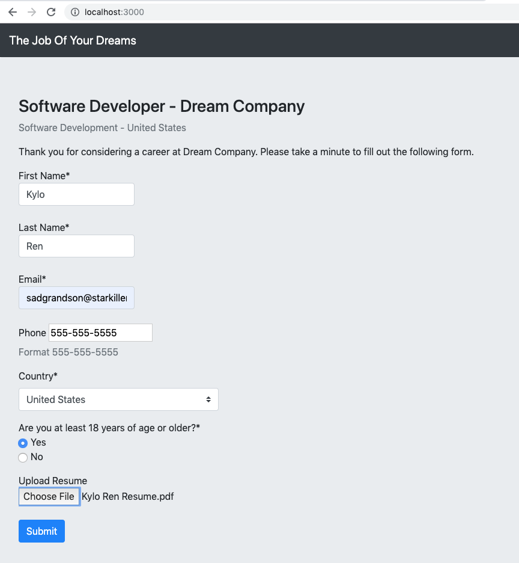
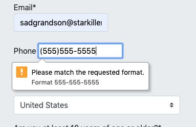
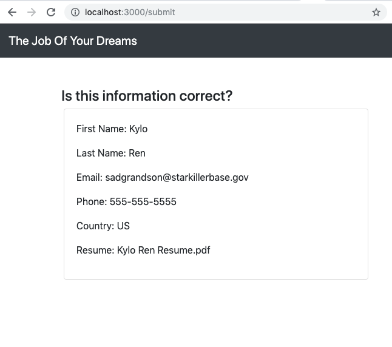

### AUSTIN COMMUNITY COLLEGE 
#### Web Software Bootcamp 

# LEARNING GOALS

It's time to go more in depth into the world of JavaScript with some advanced topics. Here we would learn some of the most exciting and useful parts of the language.

## Lecture Slides

[Lecture 10 - Intermediate JS](https://docs.google.com/presentation/d/1qclhhec-8ctUgadhwh3wPK4k0giUbhdT0SARTwSuJ1A/edit?usp=sharing)

## Self Learning Assignment 
(with suggested study times)

1. [Code Parsing](https://developer.mozilla.org/en-US/docs/Glossary/Parse) (5-10 min)

1. [Variable & Function Hoisting / 2 phase execution](https://developer.mozilla.org/en-US/docs/Glossary/Hoisting)

1. [Var, Let & Const Declarations](https://dev.to/sarah_chima/var-let-and-const--whats-the-difference-69e)

1. [YouTube Video: JavaScript Value vs Reference Types](https://www.youtube.com/watch?v=fD0t_DKREbE): This topic is critical for your understanding of javascript objects.

1. [Closures Explained](https://www.youtube.com/watch?v=71AtaJpJHw0): What are closures in javaScript and how and where to use them. (13 min)

1. [JavaScript: Deeper Dive into Objects](https://codeburst.io/javascript-essentials-objects-56373a1a6bfb): This article would give you a solid understanding of JavaScript objects. (20-30 min)

# Projects List

#### Project 1: Javascript Algorithm: Check Answers

The first input array contains the correct answers to an exam, like ["a", "a", "b", "d"]. The second one is "answers" array and contains student's answers.

The two arrays are not empty and are the same length.  Their length is not known.  Return the score for this array of answers, giving +4 for each correct answer, -1 for each incorrect answer, and +0 for each blank answer(empty string).

If the score < 0, return 0.

#### Project 2: Javascript Algorithm: Blood Alcohol Calculator

Bob has a drinking problem. He drinks so much, in fact, that he has broken the local law 
enforcement's breathalizer with his alcoholic breath! He feels simply awful, so he wants 
to make up for it by creating a function that will calculate his blood-alcohol level for 
them. Unfortunately, Bob has gotten too inebriated to do any programming today, so he needs 
your help!

    Please use the following formula for calculating BAC:

    BAC% = (A × 5.14 / W × r) - 0.015 × H

    A: Total alcohol consumed, in ounces (oz) W: Body weight, in pounds (lbs) r: The alcohol distribution ratio, 0.73 for man, and 0.66 for women H: Time passed since drinking, in hours

    Alcohol consumed will be passed as a drinks object with two properties: ounces (the total volume of beverage consumed in ounces), 
    and abv (the % of alcohol by volume of the beverage as a floating point number--such as 0.05 for 5% abv beer or 0.4 for 40% abv whisky). 
    For simplicity, Bob assures us that he drinks the same kind of beverage each time he drinks.

    The gender will be passed as a string, either "male" or "female".

    Output must be returned as a number data-type, greater than or equal to 0, with up to 4 decimal places. No error handling is needed.

    Using these parameters, create the function that will calculate Bob's and other partier's BAC.

#### Project 3: Javascript Algorithm: Sort My Pets

I have an object which contains information about all my pets. Create a JS function which outputs the same data structure, but my pets are sorted by the quantity of food I need for them, each day.

Sample unsorted data:

    var myPets = [
        {   
            "type": "camel",
            "name": "Wednesday",
            "age": 8,
            "food": "Hay, mostly",
            "daily food quantity": 30
        },
        {
            "type": "cobra",
            "name": "Slitherio",
            "age": 2,
            "food": "Rodents",
            "daily food quantity": 0.05
        },
        {   
            "type": "elephant",
            "name": "Hathi",
            "age": 1,
            "food": "Plant matter, grass, hay, fruit",
            "daily food quantity": 50
        }
    ]

#### Bonus - Project 4: HTML Form Validation

*This project is intended to reinforce topics learned in the HTML portion of the bootcamp.  Please attempt this project after fully understanding the topics covered in Advanced JS*

The focus of this project is to learn more about client-side validation of forms before they are sent to a server for rendering.

You may use basic html form validation methods such as the pattern attribute:
https://www.w3schools.com/tags/att_input_pattern.asp

You may also choose to use more advanced javascript methods instead, in order to validate your forms, but you may need to prevent the default behaviors of form submittal in order to use javascript validation methods. 

We will be rendering EJS files with express.js like we have done in previous projects.

PLEASE read ALL steps BEFORE writing your code.

##### Setup Steps:

1. Create a blank folder named `html-form-validation`.

2. Create an `app.js` file.

3. Run `npm init` and install `express.js`.

4. Also install the EJS module with `npm i ejs --save`. 

5. Create a `views` folder in your application. Express will automatically look for your templates in there.

##### Project Tasks

1. Create two pages with EJS
    * home, with route `localhost:3000/`
    * submit, with route `localhost:3000/submit`
    * You may use bootstrap for styling but style is not the focus of this project

2. On the home page, create a form with `action="/submit" method="POST"` 

##### Form Requirements:

1. First Name and Last Name (user cannot leave blank)
    * First Name should automatically get focus when page loads.
    * Must be text input.
    * Must be between 1 and 20 characters in length
    * Cannot contain numbers or special characters
2. Email (user cannot leave blank)
   * Use pattern attribute to require input format to be: `user123@email.com`
   * Input cannot be more than 100 characters
3. Phone Number
   * Use pattern attribute to require input format to be: `555-555-5555`
   * Input must be exactly 12 characters in length
4. Country (user must select an option)
   * Use a select to create a dropdown menu of country names
5. Check that user is 18 years of age or older (User must check yes or no)
   * Use a radio button 
6. Include a file input for the user to upload a copy of their resume
   * File input must only accept the following file types:
     * DOC, PDF, RTF, and TXT
7. Include a button to submit the form

      

8. If invalid data is provided, user prompts should provide descriptive instructions

      

9.  Now, using EJS tags, you must render the contents of the form onto the submit page so that the user can verify their information. 

      

10. Using Bootstrap will make this easier!!!!
