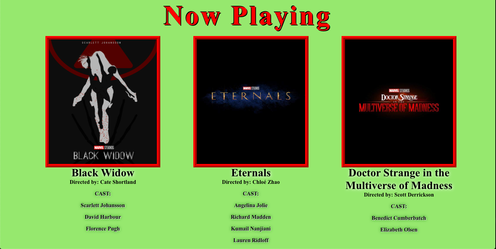
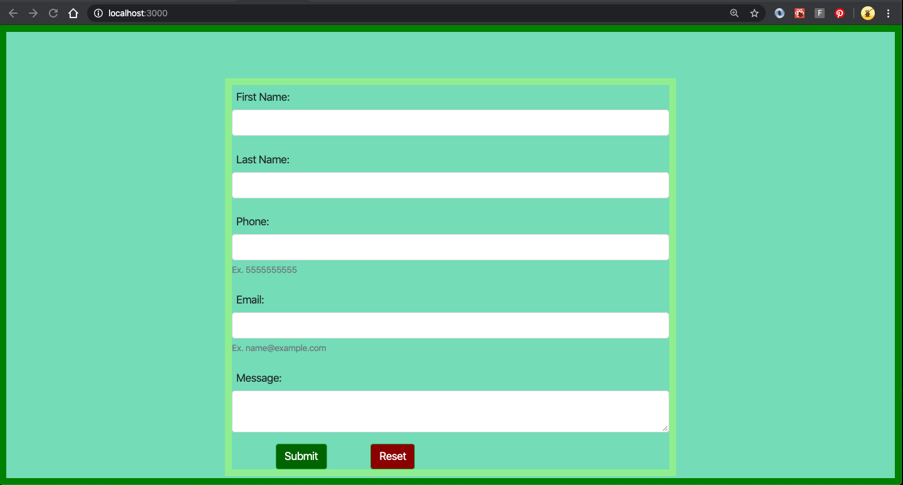

### AUSTIN COMMUNITY COLLEGE 
#### Web Software Bootcamp 

# LEARNING GOALS

Welcome to React!

React is a front end library that was created by Facebook in 2013. It has since exploded in popularity in the web/mobile developer community.

React is going to be the last big topic that we will be talking about in the bootcamp. After that, the focus will be on mastering everything that we have learned and using this knowledge to build meaningful real life web applications.

After all the lectures, you should be able to:

    1. Use create-react-app to build a basic app template
    2. Understand the difference between HTML and JSX
    3. Be able to pass props from one component 'down' to another
    4. Be able to set state of a component as needed
    5. Use React-Router to navigate to different components as needed
    6. Basic (re)understanding of CSS and how it behaves differently with React - Router
    7. Use basic libraries such as Fetch and Axios in order to serve APIs
    8. Experiment with different ideas in order to complete projects
    9. Connect to Mongodb with your React app
    10. Use Chrome React Dev tools to assist in all aspects of React development
		
You are encouraged to attempt projects ahead of time but please keep in mind that they are designed to be learned IN ORDER; they build upon knowledge from previous lectures.

As for class attendance, it is extremely important to attend "in person" as the bulk of information requires lectures, code-alongs, and asking questions. You will probably notice right away that we are no longer dealing with a handful of files but rather many folders with many files in each folder. This can get very confusing very quickly if you miss out on a lecture. For example, what roles do the following files play in React: `index.html`, `index.js`, and `index.css`? Yes, we will be using all three PLUS many, many more!!!

And remember, this is a marathon and not a sprint. There is a lot of information you are about to be exposed to so take a breath, work the projects, ASK questions and enjoy the new world you are about to enter.

## INSTALLING REACT DEV TOOLS FOR CHROME

Before continuing, you need to install a dev tool extension for Chrome that will make your job easier when working with React. Please install a Chrome extension called ‘React Dev tools’ to help you out.

In order to better utilize all our resources, and to ensure we have the best tools going forward, it will be important to understand how React works ‘under the hood.’

At first, this will not make any sense and this tool may not be used. But when we start delving into ‘props’ and ‘state’, being able to see these in your browser will be invaluable.

`NOTE:` Going forward, you need to use Chrome as much as possible, especially for react projects:

1. Open Chrome
1. Click on -> Windows tab
1. Click on -> Extensions
1. Search for “React Developer Tools”
1. Install

## TUTORIAL
<h3>TIME REQUIRED - 3 hour 20 min</h3>

Please go through sections 1 - 5 only.

I strongly recommend you code along so plan on spending roughly 6-8 hours total on this. You do not need to do this all at once but the more you finish before class

[React: Getting Started](https://app.pluralsight.com/library/courses/react-js-getting-started/table-of-contents)

### [Quiz 18 - React: Getting Started Tutorial](https://docs.google.com/forms/d/e/1FAIpQLSew_Tyj_Y8ttm8mdXMzKjlnMzzHZTR8z2GX35BYlEhomKQhKg/viewform)

## Introduction

[Introduction to React](https://docs.google.com/presentation/d/1Qr5WRrDaMj7QVPWCc_Gla3DJZvvrlLgcrGNumDlqIXo/edit?usp=sharing)

What is React and why should we use it? React is great for building single page applications and mobile apps (React Native). React has become very popular and is maintained by Facebook. In fact, if you have the Chrome React dev tool extension installed, you should see Facebook is built with React, as well as Instagram.

Other organizations that use React include Airbnb, Apple, and Netflix. If you go to Indeed.com, you should see tens of thousands of jobs across the world looking ofr developers with React experience.

Check out this [article](https://medium.com/@TechMagic/reactjs-vs-angular5-vs-vue-js-what-to-choose-in-2018-b91e028fa91d) comparing the 3 top popular frameworks/libraries:

React  
Angular 
Vue

React is a view library using something called “components." Everything in React is a component, and you can frequently reuse these components. Very similar to how EJS used templates that could be reused and allowed for passing of data through those templates.

Building an entire application in a single component is not a great idea as it can grow huge, complex, and difficult to maintain and test. It is a good idea to start looking at applications using the idea of components. By breaking an app down into components allows the app to be easier to test and easier to keep track of what functionality goes where.

React components are written using JSX. It stands for “JavaScript XML”.

    const element = (
            

                    <h1>Hello</h1>
                    <h2>Good to see you here</h2>
            

    )

This is an example of JSX. It looks like HTML. However, when it is run, this code is converted to pure JavaScript commands by Babel. 

Babel is a transpiler, which converts JSX into JS, among other things it can do. Then React converts the JS into plain HTML embedded with dynamic data, which the browser can interpret .

Babel is a transpiler.  It is a program that converts code in one language into another language (e.g. convert JSX to ES5).  Also, in recent years, JavaScript developers have created newer versions of the JavaScript language with new features (e.g. ES6).  However, not all web browsers recognize these new features.

Babel takes the new JavaScript code (ES6) and convert it into the old JavaScript code so that all web browsers can understand it.

https://babeljs.io/

## Props

Slide deck -> [React - Props](https://docs.google.com/presentation/d/1eZVVt2-W9Q917CuFQJX3bviTATmgedxkWyRd0vr1bEw/edit?usp=sharing)

Props is how we pass properties (variables) from one component to another. How do we know this is actually happening? We can use certain tools available through Chrome to assist with our development.

What is destructuring and how to use so you can speed up your coding and make more legible.
How to use mapping and keys to build your components and ensure uniqueness.

## State

Slide deck -> [React - State](https://docs.google.com/presentation/d/14vZKA6Z2sa75nvzQ-rMSuxNnjQAN-T06r6NuahbxTs4/edit?usp=sharing)

Any time there are changes to data,  or changes to the 'state' of your page, we need to be able to make sure your page updates.

Remember, props cannot change. However, state can, so how do we utilize this to our advantage.
After a more in depth look at props, and how to map various data that we hard code, we can now change the state, change the data, that is passed.

We can use a a simple form input to show how state is created (this.state), and changed (this.setState).

Go to this link and BUILD the tic-tac toe game: (https://reactjs.org/tutorial/tutorial.html)

Though your instinct may be to think this is not worth your time, but I ensure you it is a valuable resource to understanding props and state.

## Routing

Slide deck -> [React - Routing](https://docs.google.com/presentation/d/1-wnemu9X70TcBw3bQ6SqY02GS5v3o-7kF4etKELiauQ/edit?usp=sharing)

When dealing with links and routing, React has a special way of making sure the correct component loads.  This is done with React-Router.

Also, we need to up our understanding on the way CSS works with different components and the way they are mounted.

## APIs

Slide deck -> [React - APIs](https://docs.google.com/presentation/d/1XuvFDoX8zJ9eFH03X1qjuMVCtzMK6Nw5-Sx5vDn-sH8/edit?usp=sharing)

Currently, you can build a basic react app and you can pass props and state with your components IF you supply the data.

But what if we need the data from an outside source? 

Using fetch(), you are now going to be able build a basic app that consumes data from a third party and display the results with basic component building.

### `NOTE:` The following lectures will take place as time permits and may not necessarily be back to back so PLEASE do not stress about these until we decide to work on in class.  There are no projects that go with these; these are all in-class demos and code-alongs to round out your exposure to React.

## Passport.js

[Passport.js](https://docs.google.com/presentation/d/1pF7vGxK3bwg2TqLOeg7idl2LDtu8sbkyubXXI6Zmq4M/edit?usp=sharing)

We are going to take a slight detour and discuss authentication and how this works with Node and routing. This particular lecture is not related to React but is vitally important to understand for the real world.

## Passport.js with React and Servers

Passport with React and Servers - TBD

Now that we are done with our detour, it is important to understand how Passport works with React. In order to better grasp this, we are going to dive right back into React, routing and add our knowledge of authenticating.

## Lifecycyles and Hooks

Slide deck -> [Lifecycles and Hooks](https://docs.google.com/presentation/d/141XVcDA1UHO3GIeu2hnql8kcnMZawPH-l6EKL5v05bc/edit?usp=sharing)

With React, you may have noticed some strange (unexpected) behaviors. This is probably due to lifecycle events. We are going to discuss the basics with in-class demos related to React and lifecycles.

We will also give a brief overview of hooks and how they can make our coding easier.

## Redux

[Redux](https://docs.google.com/presentation/d/14e2A_1cvx9UpTO5PCPLUjIhEOV1sDfL_sbJttzLwdzk/edit?usp=sharing)

By now, you have probably learned and practiced with state and are frustrated with only being able to pass state down from parent to child components. With Redux, we are going to go over how to control state in a way that any component, anywhere can have access to state.

## FURTHER  - Self Learning

1. #### [React Step by Step Guide by Facebook](https://reactjs.org/docs/hello-world.html)

    This is a learning style I enjoyed. You mileage may vary. This is for those who has a lot of "why" questions along with learning how to code in React.

1. #### [The Road to Learn React - Robin Wieruch - PDF Book](https://drive.google.com/file/d/1II-z0lwejYp5941mmydfaoNHWCwPa_kW/view?usp=sharing)  

    This book is part of Robin's Road to React Course.  I found that the Beginner (free) course covers almost everything you need to know about React before we dive into our Final Project.

    He provides a lot of code to review and work off of, using links to github repositories.

1. #### [React Tutorials by The Net Ninja - Youtube](https://www.youtube.com/playlist?list=PL4cUxeGkcC9ij8CfkAY2RAGb-tmkNwQHG)
    This provides a good, short overview and has been very liked by some of our past students. However, it should be noted that the videos have not been updated to include function based components and new hooks such as setState() and useEffect(). Otherwise, it is still a great way to get down and dirty with React.

#  PROJECTS

## Project #1 - Four Boxes

#### Your task is to build a basic React app that will display 4 equal boxes in your browser. Each box will be a different color assigned using the Math.random() method.

#### REQUIREMENTS:

1. You need to have a minimum of 8 different colors that will be used for your boxes.
2. Boxes must be identical in size.
3. All four boxes MUST be displayed in a a single row
	

## Project #2 - Four Boxes with borders

#### Your task is to build a basic React app that will display 4 equal boxes in your browser with each box having a different color border. Each box will be a different color assigned using the Math.random() method as well as randomized border colors. 

#### REQUIREMENTS:

1. You need to have a minimum of 8 different colors.
2. You will use the same color options for borders AND boxes
3. Boxes must be identical in size.
4. All four boxes MUST be displayed in a a single row
5. Borders need to be 10px and your choice of style (solid, ridge, dashed, etc...)
6. Borders must NEVER be the same color as boxes
	
## Project #3 - Four IDENTICAL Boxes with borders 

#### Your task is to build a basic React app that will display 4 equal boxes in your browser with each box being IDENTICAL. Each box will be the same color assigned using the Math.random() method as well as the same border colors. 

#### REQUIREMENTS:

1. You need to have a minimum of 8 different colors.
2. You will use the same color options for borders AND boxes
3. Boxes must be identical in size.
4. All four boxes MUST be displayed in a a single row
5. Borders need to be 10px and your choice of style (solid, ridge, dashed, etc...)
6. Borders must NEVER be the same color as boxes
7. ALL four boxes should be IDENTICAL
8. Use props to pass styles to a CHILD component
	
## Project #4  - Four DIFFERENT Boxes with borders 

#### Your task is to build a basic React app that will display 4 boxes in your browser with each box being different sizes. Each box will also have different colors assigned using the Math.random() method as well as the different colored borders. 

#### REQUIREMENTS:

1. You need to have a minimum of 8 different colors.
2. You will use the same color options for borders AND boxes
3. Boxes must be DIFFERENT in size.
4. All four boxes MUST be displayed in a a single row
5. Borders need to be 10px and your choice of style (solid, ridge, dashed, etc...)
6. Borders must NEVER be the same color as boxes

## Project  #5 - Jon Arbuckle

Your goal is to rebuild the Jon Arbuckle site you built back in the HTML module.

1) Convert the Jon Arbuckle HTML product into React
1) Make sure you alter code so the the tab in your browser says 'Jon Arbuckle'
1) Add a `favicon` of your choice. You will have to do research on how to make this happen :
    https://medium.com/@jenniferdobak/the-public-folder-and-favicons-in-create-react-app-8dc2cc1d492b
1) Make sure to read the very last line of the article above. If this is the case, where do you need to add your image?
1) CSS - add a border to the image, and have the introduction under the image set so it is 75% of the width of the browser.

## Project  #6 - Steve Jobs

Your goal is to rebuild the Steve Jobs site you built back in the HTML module.

1) Convert the Steve Jobs HTML product into React
1) Build an array inside the `app.js` that contains the links and descriptions for the videos
1) Build a component called `Videos.js`
1) Iterate through your links object in a way that will display all three vidoes with their descriptions. `NOTE:`You CANNOT hard code the videos in your `App.js`, they need to be imported with the `Videos.js` component and by passing the links from the array as props.
1) You will also need to build your descriptions within your iterator.
1) You may encounter MANY issues with YouTube videos. These are minor issues that can be fixed if you use Google and pay detailed attention to your links. 
1) Pay attention to your dev tools inside Chrome - they will help guide you and let you know what the errors are.

## Project  #7 - Movie React App

Your task is to build a React app with a movie theme. This project is going to push your knowledge from all previous projects. It will be a challenge. Most of the content has been covered in class, but you are still going to have to do some research and test creative code to get it to work. There are MANY ways to do this, so please do not get bogged down with how others do it. Find your own way.

End result should look something like this:

#### Task #1 - Create App

1. Create an app called `movies` using `create-react-app`

#### Task #2 - Create an external JSON file

1. Since we are not using an API or database, you are going to have to hard-code your own data
2. Create a file called `data.js` inside your src folder
3. Your file needs to include `title`, `director`, `cast`, and `image` in "name:value" pairs.
	1. Example: `"fName": "Student"`
	2. NOTE: You are dealing with JSON so go back over previous projects and notes to see how JSON is used
	3. Your file is going to be an array with 3 objects in it:
		1. Each object is going to have `title` as a string value
		2. Each object is going to have `director` as a string value
		3. Each object is going to have `image` as a path value (locally or external)
			1. This value should lead to an actual image that will be displayed
		4. Each object is going to have `cast` as an ARRAY with a MINIMUM of 2 actors from the movie

#### Task #3 - Build Components

1. Re-arrange your App Component
	1. You should only have one component imported in your App.js -> Movie Component
	2. You will import data from an external javascript file created above
	3. Data will be passed down to ALL other components via props
2. Build a Movie Component
	1. Movie component should be comprised of a Poster component and an Info component
	2. [Iterating through arrays in React - StackOverflow](https://stackoverflow.com/questions/29149169/how-to-loop-and-render-elements-in-react-js-without-an-array-of-objects-to-map)
	3. You are going to have to use your Javascript knowledge, in-class projects, creativity, research  and trial-and-error to make it work - there are many ways to get the same result.
3. Build a Poster Component
	1. Will return an image using props passed down from App.js
	2. The `alt` attribute will use `title` that is passed down as props from App.js
4. Build an Info Component
	1. Will use props passed down from App.js
	2. Will return title, director, and cast array
	3. See looping link above
	
#### Task #4 - CSS

1. EACH component should have its own CSS file. I.e., there should be an App.css file, Movie.css file, etc...

    Feel free to tweak colors and fonts.

#### Task #5 - HAVE FUN!!!!!!!

## Project #8 - Breakfast App

Your goal is to rebuild the Breakfast site you built back in the HTML module and convert it all into React.

#### Task #1 - file structure and assets

1) Create your React app and call it `breakfast`.
1) Create a folder called `Components` inside your `src` folder.
1) Inside your Components folder, create three components `Home.js`, `Menu.js`, `Catering.js`
1) Inside the `src` folder, make sure you have an `assets` folder, and inside that folder create an `image` folder to hold your images.

#### Task #2 - App.js

1) Inside the `App.js` component, build your routes
1) Did you install the correct module?
1) Make sure to import your components that match your routes

#### Task #3 - Home.js

1) Copy your code from the original project 'home' page and make changes as needed so there are no errors.
1) Import the image needed for the food image
1) Set up your imports in order to use `Link`
1) Replace your `<a>` tags with Link tags
1) Test your code. 

#### Task #4 - Menu.js

1) Copy your code from the original project 'menu' page and make changes as needed so there are no errors.
1) Import the images needed for the food image
1) Set up your imports in order to use `Link`
1) Replace your `<a>` tags with Link tags
1) Test your code.

#### Task #5 - Catering.js

1) Copy your code from the original project 'catering' page and make changes as needed so there are no errors.
1) Set up your imports in order to use `Link`.
1) Replace your `<a>` tags with Link tags
1) Test your code. 

## Project #9 - Form with Mongo

The goal of this project is to build a full stack MERN (Mongo Express React Node) app. The app has only one component, a server running with Node and a mongodb to save data.

#### Task 1 - Installs

1. Use create-react-app to initiate your project
1. Install the following modules as dependencies:

        axios
        body-parser
        bootstrap
        cors
        dotenv
        express
        mongoose
        reactstrap

1. (Optional) Install the following modules as dev dependencies:

        chalk
        morgan
      
1. Make sure to check out docuemntation for all modules above as needed.

#### Task #2 - Server

1. Inside your `src` folder, create a folder called `server`
1. Inside the server folder, create two separate files -> `.env` and `server.js`
1. Inside the `.env` file, add one line of code: `PORT = 3001` . NOTHING else goes in this file.
1. Build your server using express, body-parser, and cors. 
1. Read [documentation](https://www.npmjs.com/package/dotenv) on how and where to require `dotenv`
1. Require chalk and morgan if needed.

#### Task #3 - Mongo and Mongoose

1. Inside `serverjs`, set up mongoose to be used with a mongdb
1. Build your connection
1. Build your schema - you will need the following:

        First name - required
        Last name - required
        Email - required
        Phone
        Message - default: 'No message submitted'
    
1. Build your model
1. You should only need one route handler that will post your data to mongo

#### Task #4 - App.js

1. You will need to import `axios` and `reactstrap` - make sure to read the [documentation](https://reactstrap.github.io/) on how to install reactstrap properly!!
1. With reactstrap, you will need a basic form that will take a first name, last name, email, phone, and a text area for a message. `NOTE:` Make sure these inputs match your schema in your `server.js`
1. You will need to use 'state' to keep track of the user inputs.
1. Use `onChange` to handle state and `onSubmit` to initiate an HTTP request using `axios`
1. You need one button for submitting and a second button for resetting the form IF it has not been submitted (see image below)
1. Axios needs to be used to send the data to the server.
1. Once form is submitted correctly, all fields need to be reset. `HINT:` after a successful response from the server, you may need to reset state for each of the fields back to its initial state - many ways to do this.

#### Task #5 - CSS

1. Be creative with your styling.

FINISHED PRODUCT should look similar to this:

